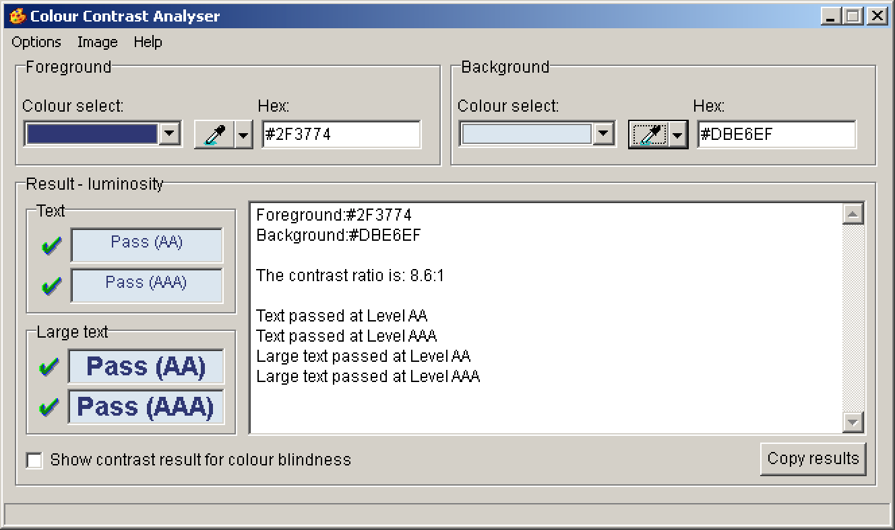

# How to precisely examine colour contrasts

**Calculating contrast ratios is complex. Fortunately there are contrast calculators which take care of the math. We only need to provide the correct colour codes – which has a few potential pitfalls.**

There are a lot of tools available to calculate the contrast between two colours. For Windows and macOS users we recommend the [Colour Contrast Analyser (CCA)](/setup/helper-tools/colour-contrast-analyser/).

Simply enter a foreground and a background colour into the respective fields and the CCA immediately returns whether or not the contrast ratio is sufficient, depending on the kind of visual content and size. The evaluation uses the recommendations from the WCAG 2.1 guidelines for [colour contrast level AA](https://www.w3.org/TR/WCAG21/#contrast-minimum) and [colour contrast level AAA](https://www.w3.org/TR/WCAG21/#contrast-enhanced).

When calculating a contrast ratio, it is very important to use the “right” colour codes. In the context of web applications these are the values defined in CSS. But what is the best way to get to these values?

## DOM inspector

The most trustworthy source is the browser's DOM inspector.

Right-click on an element and choose `Inspect` (depending on your browser the term might vary) to show that element in the DOM inspector. Now you can find the element’s colour values in the `Styles` tab.

Now simply copy the colour code and paste it into CCA.

## Colour picker

In some situations there is no hard-coded colour value available (e.g. when working with pixel images) or the values in the DOM inspector don’t tell the whole story (e.g. when working with transparency).

To account for this, a lot of contrast checkers offer colour pickers. While they are very handy, they open up some potential pitfalls.

### Anti-aliasing

Most modern browsers apply anti-aliasing to make the edges of rendered elements smoother (see [Anti-aliasing (Wikipedia.org)](https://en.wikipedia.org/wiki/Spatial_anti-aliasing))

When you are picking a colour from such an element, be sure to avoid anti-aliased areas, as this would have a drastic impact on the result.

### Colour profiles

Colour that is displayed on screen may slightly differ from its definition in the code. This is due to the various colour profiles that are used by monitors, operating systems and browsers.

So if you are using colour pickers, the picked colour may differ from its true definition.

## Conclusion

Working with colour pickers can save a lot of time.

In general though: if a result is very close to the required contrast limit, we recommend to re-check it by examining the real colour definitions (if available) from the DOM inspector.
