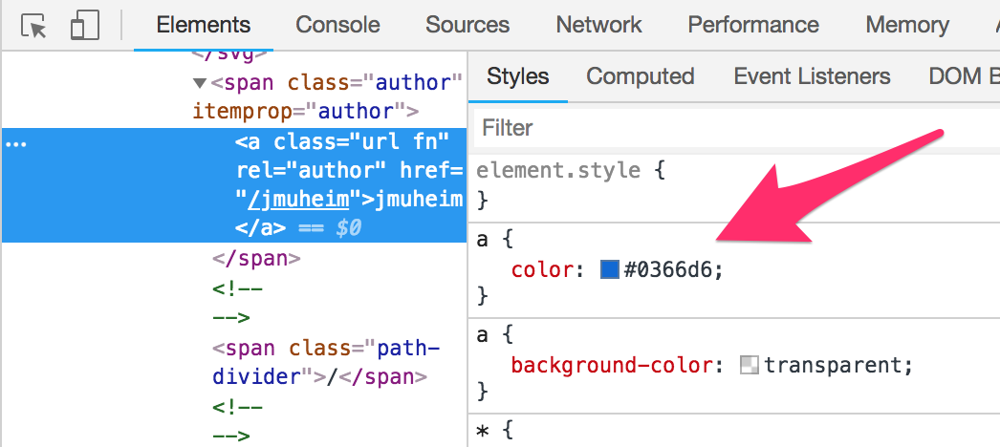

# How to examine colour contrast

**Calculating contrast ratios is complex. Fortunately there are contrast calculators which take care of the math. We only need to provide the correct colour codes – which has a few potential pitfalls.**

[[toc]]

## Colour Contrast Analyser

There are a lot of tools available to calculate the contrast between two colours. For Windows and macOS users we recommend the [Colour Contrast Analyser (CCA)](/setup/helper-tools/colour-contrast-analyser/).

When calculating a contrast ratio, it is very important to use the "right" colour codes. In the context of web applications these are the values defined in CSS. But what is the best way to get to these values?

## DOM inspector

The most trustworthy source is the browser's DOM inspector which gives direct access to the values defined in the source code.

Right-click on an element and choose `Inspect` (the term might vary depending on your browser) to show that element in the DOM inspector. Now you can find the element's colour values in the `Styles` tab.

## Colour picker

Sometimes the colour values aren't defined in the source code (for example when working with pixel images) or the values in the DOM inspector don't tell the whole story (for example when working with transparency).

To account for this, a lot of contrast checkers offer colour pickers. While they are very handy, they open up some potential pitfalls.

### Anti-aliasing

Most modern browsers apply anti-aliasing to make the edges of rendered elements smoother (see [spacial anti-aliasing (Wikipedia.org)](https://en.wikipedia.org/wiki/Spatial_anti-aliasing))

When you are picking a colour from such an element, be sure to avoid anti-aliased areas, as this would have a drastic impact on the result.

### Colour profiles

Colour that is displayed on screen may slightly differ from its definition in the code. This is due to the various colour profiles that are used by monitors, operating systems and browsers. So if you are a using colour picker, it could show you a different value than what has been defined in the code.

**A general recommendation:** Use colour pickers and profit from the time they save you. But if a result is very close to the required contrast threshold, we recommend to verify it by examining the real colour definitions (if available) in the DOM inspector.