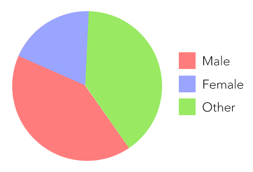
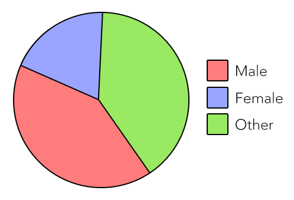
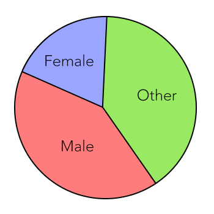
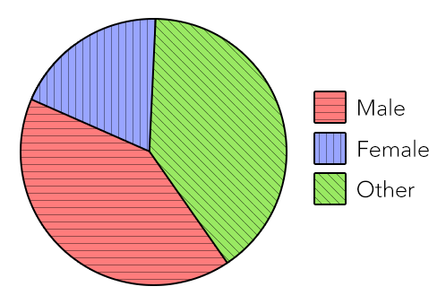

# Contrast requirements of non-text content

**The Web Content Accessibility Guidelines (WCAG) 2.0 only required a certain colour contrast level for text. Finally, the recently published version 2.1 has added colour contrast requirements for both user interface components and graphical objects.**

Non-text content needs a contrast ratio of at least `3:1` against adjacent color(s).

## User interface components

There is not much value to interactive elements on a page, if a user can not perceive them.

For example, if the fields of a contact form have borders with low contrast, a user with low vision may not be able to fill them.

## Graphical objects

Graphical objects often rely on colour codes to convey meaning.

For example, a pie chart has three sections, described using a legend like this:

- Male (red)
- Female (blue)
- Other (green)

To a visually non-impaired user, this pie chart should not pose any problem. But the colour contrasts are way too low:

- Red/blue is `1.1:1`
- Blue/green is `1.5:1`
- Green/red is `1.7:1`

This is due to the fact that colours are no key factor for calculating contrast. So even with only a few sections you will run out quickly of high contrast combinations.

### Enhancing contrasts

First of all you should add a clearly visible stroke around the sections. This way the sections' colours do not need to have high contrast against each other anymore.

Still, the colours cannot be assigned successfully by people with low contrast vision. To make up for this, you should place the descriptions right inside the sections...

...or draw lines between the sections and their respective descriptions.

### Adding background patterns

In other cases, adding a unique background pattern to both each section and the respective labels in the legend can be very useful. Needless to say that such patterns also need to be contrasty enough.

