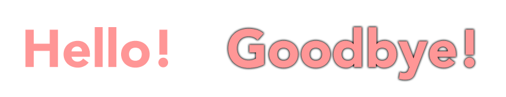
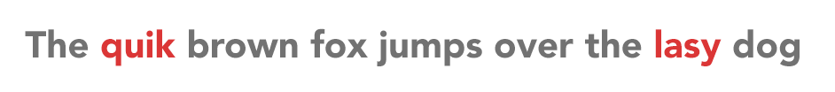
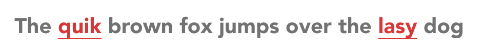

# Contrast requirements of text content

**There is a general minimal colour contrast level for all kinds of text, and a slightly lower one for large text. The requirement applies to both "real" text and rasterised text on images.**

## Real text

With "real" text, we mean text that is truly available as an arrangement of character codes (like this text here). Some of its inherent characteristics is that you can select it, and copy&paste it between applications. It is machine-readable.

In general, text needs a contrast ratio of at least `4.5:1` against adjacent color(s).

For example, the following image has a white background and shows a text with a colour gradient overlay from white to black.

The white on the left has a contrast ratio of `1:1`. The black to the right has a contrast ratio of `21:1`. Somewhere around the `m`, the required contrast of `4.5:1` is reached.

### Large text

There is a single exception to the general rule: "large" text. It is considered easier to read; as such it needs a lower contrast ratio of at least `3:1` against adjacent color(s).

Large text is defined as:

- Either **bold** text of at least 14 points (or 18.5 pixels).
    - For example `font-size: 14pt; font-weight: bold` (or `font-size: 18.5px; font-weight: bold`).
- Or regular text of at least 18 points (or 24 pixels).
    - For example `font-size: 18pt` (or `font-size: 24px`).

Note: the ratio between sizes in points and CSS pixels approximately is `1pt = 1.333px`.

Let us look again at the previous image's text with gradient overlay.

Somewhere around the `x`, the required contrast of `3:1` is reached (compared to the `m` with a ratio of `4.5:1`).

Look at the following image that displays both large and default text with contrasts of exactly `3:1` and `4.5:1`.

It may not seem like much of a difference, but in fact it heavily enlargens the number of possible colour combinations.

## Exceptions

There are some exceptions to the contrast requirements of text content.

- **Logos** usually must adhere strictly to a corporate's design guidelines and thus may be displayed in its original colours (needless to say that it still is unpleasant if your clients cannot perceive your logo).
- **Decorative** text: this could be the background pattern of an image that is created from random words.
- **Incidental** text: this could be a random street sign somewhere in the background of a photograph.
- **Disabled** text: this could be a disabled from control's label.

## Enhancing contrasts of text

To improve contrast, instead of completely changing a text's colour (or its background), there exist some less obtrusive solutions.

### Increasing contrast using shadow

By adding a shadow to text, its own colour may not be of relevance anymore.

For example, look at the following image. It shows two words, both with a red fill that has an insufficient contrast of `2.1:1` to the white background.

The shadow of the second word results in a contrast of appropriately `4.5:1`.

In CSS, the appropriate attribute would be something like `text-shadow: 0 0 2px #000`.

### Enhancing non-homogeneous backgrounds

In some cases, text is displayed on non-homogeneous backgrounds. Depending on the heterogeneity of the background, the text may be very hard to read.

For example, look at the following image. It shows a white text "Welcome to the beach!" on blue sky with some white clouds. The text clearly is hard to read, as it often overlaps with white clouds.

You could increase its contrast using text shadow as described above. But in this situation, adding a semi-transparent darkening background to the text sometimes gives a better result.

Of course you can also combine different solutions to add up their effects.

### Adding graphical information

Sometimes, pure colour is used to convey meaning. For example, the following image shows a gray text, and some of the words are highlighted red to mark spelling mistakes.

The colour contrast ratio between the gray and the red is `1:1`! A colour-blind person will not be able to spot any difference.

In such situations, it is useful to add some additional graphical information. For example, simple underlining of the mistakes solves the problem.

Or add an icon to it, in the following case an exclamation mark.

By the way, make sure that such graphical information always offers adequate semantical meaning (if you are really curious and want to learn more about this, skip ahead and read [Semantics and their importance for accessibility](/knowledge/semantics/)).

## Text on images

With text on images, we mean text that is printed on a rasterised image like JPG or PNG (like the example images in the text above). During rasterisation, text loses most of its inherent characteristics, so neither you can select it (and copy&paste it), nor is it machine-readable by default.

In general, for text on images, the same rules apply like for "real" text.

### Downsides to real text

Keep in mind that an image's points per inch (PPI) value may vary, and scaling images up or down in a browser will also influence its display size. Furthermore, do not forget to set the displayed text as the image's alternative text (`alt` attribute), so blind people can perceive it.

In addition to this, compared to "real" text, placing text on images has some more downsides:

- It does not scale as well because it tends to pixelate.
    - To address this issue, consider supplying an image of higher resolution (so it can be scaled up without quality loss to some degree).
- Changing foreground and background contrast and color combinations is hardly possible, but desired by some users (like visually impaired ones).
- It cannot be replaced by the user with a custom font (for example a dyslexia-friendly one).
- It does not reflow and can lead to horizontal scrolling, especially when zoom is applied to the website.
- It is much heavier in file size and triggers an additional server request; as such it slows down rendering.

Alas, we recommend not to use text on images. The usage of pure text images can be seen as a relict of older days where custom fonts could not easily be included and styled as needed. Nowadays, please use custom fonts and CSS styles if possible.
