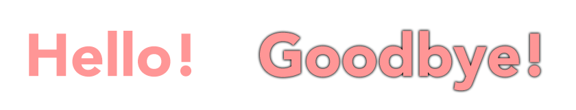

# Colour contrast for text

**There is a general minimal colour contrast level for all kinds of text. As an exception, large text can have slightly lower contrast. This requirement applies to both "real" text and rasterised text on images.**

[[toc]]

## Minimal contrast ratio

The Web Content Accessibility Guidelines (WCAG) specify a [minimal contrast ratio of `4.5:1` against adjacent colour(s) for text in general](https://www.w3.org/TR/WCAG21/#contrast-minimum). An exception is made for large-scale text: It is considered easier to read and can therefore be set in a lower contrast ratio of at least `3:1`.

Large-scale text is defined as:

- Either **bold** text of at least 14 points (or 18.5 pixels).
- Or regular text of at least 18 points (or 24 pixels).

For more information see [WCAG definition of "large scale (text)"](https://www.w3.org/TR/WCAG21/#dfn-large-scale).

To illustrate this: the following image shows the sentence "The quick brown fox jumps over the lazy dog" written on white background. It has 43 characters. The first character "T" has the colour white. The colour of following characters gets gradually darker, the last character "g" is fully black.

Somewhere around the "x" (the 19th character) the contrast ratio reaches `3:1`. Somewhere around the "m" (the 23rd character) we arrive at `4.5:1`. The last character has the maximum colour contrast ratio of `21:1`.

For a more direct comparison: the following image shows both large and default text with contrast ratios of exactly `3:1` and `4.5:1`.

It may not seem like much of a difference, but in fact it heavily enlargens the number of possible colour combinations.

It is important to mention that the values `3:1` and `4.5:1` represent a **minimal** standard for **acceptable** contrast, they don't represent an ideal. They should be treated as threshold and not as target; aiming higher is recommended. 

## Enhancing text contrast

Besides changing the colour of the text or the background there are many other ways do enhance contrast. For example:

### Adding shadow

Drop shadow around text can make up for insufficient contrast between text colour and background.

For example, look at the following image. It shows two words, both with a red fill that has an insufficient contrast of `2.1:1` to the white background.

The shadow of the second word results in a contrast of appropriately `4.5:1`. 

In CSS this could be something like `text-shadow: 0 0 5px #000`.

### Adding a contrast layer

In some cases, text is displayed on non-homogeneous backgrounds. Depending on the heterogeneity of the background, the text may be very hard to read.

For example, look at the following image. It shows a white text "Welcome to the beach!" on blue sky with some white clouds. While there is decent contrast between white text and blue sky there is almost no contrast between white text and white clouds. Overall it's very hard to read.

You could increase contrast by adding a text shadow as described above. Or you could add a semi-transparent darkening layer between text and background.

Of course you can also combine different solutions to add up their effects.

## Exceptions

There are some exceptions to the contrast requirements of text content.

- **Logos** usually must adhere strictly to corporate design guidelines and thus may be displayed in those colours regardless of contrast ratios (needless to say that it still is unpleasant if your clients cannot perceive your logo).
- **Decorative text:** this could be the background pattern of an image that is created from random words.
- **Incidental text:** this could be a random street sign somewhere in the background of a photograph.
- **Disabled text:** this could be the label of a disabled element in an online form.

### What about placeholder text?

The WCAG's contrast requirement for text also applies to placeholder text. But it's important to mention that placeholders offers a bunch of usability and accessibility challenges beyond just adequate contrast – sometimes even because of adequate contrast. For more information see this [article about why placeholders in form fields are harmful](https://www.nngroup.com/articles/form-design-placeholders/)

## "Real" text vs. text images

With "real" text, we mean text that is available as an arrangement of character codes (like this text here). It is inherently machine-readable and can be selected and copy-pasted. "Text images" on the other hand are rasterised pictures of typography (like the example images in the text above), e.g. stored as JPG or PNG files. 

In general, the same contrast requirements and exceptions apply for "real" text and for text images. 

As an aside: Due to the many limitations of text images in terms of flexibility, usability and file size we generally recommend against using it. However, if you *have* to use text images make sure that the displayed text is set as the image's alternative text (`alt` attribute) so that it is accessible for screen reader users.
