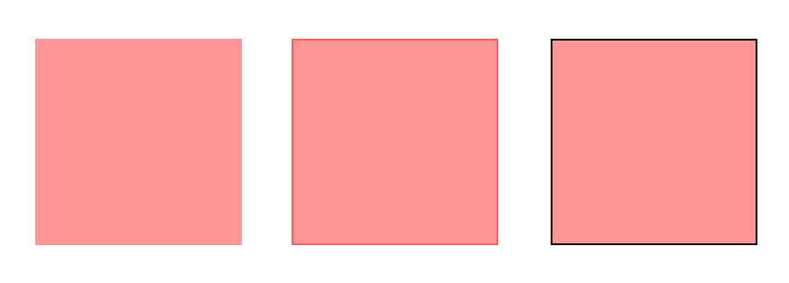

# Tips and tricks to improve contrasts

To improve contrast, instead of changing a full element's colour (or its background), there exist some less obtrusive solutions.

## Increasing contrast using borders

By adding a dark border to an element, the element's own colour may not be of relevance anymore.

For example, look at the following image. It shows three boxes, all of them with a red background that has an insufficient contrast of `2.1:1` to the white background.

But the boxes have different borders:

- The left box has no border at all: it clearly fails contrast requirements.
- The box in the middle has a border in a dark red: it has a contrast of `3.1:1` to the white background and passes requirements.
- The right box has a border in black: it has a contrast of `21:1` to the white background and passes requirements.

In CSS, the appropriate attribute would be something like `border: 1px solid #000`. The bad news is that this does not work with text.

## Increasing contrast using shadow

Like adding a border, an added shadow may enhance contrast to the background.

In CSS, the appropriate attribute would be something like `box-shadow: 0 0 2px #000` or `text-shadow: 0 0 2px #000`. And the good news is that this also works with text.

## Adding shapes to support colours
