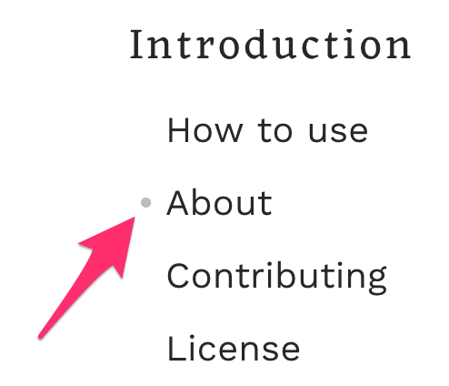
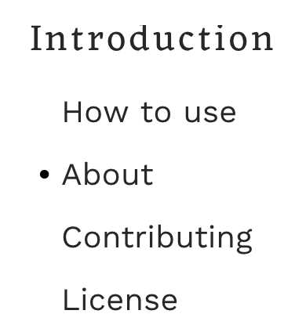

# Contrast requirements of user interface components

**There is not much value to interactive elements on a page, if a user cannot perceive them. The [Web Content Accessibility Guidelines (WCAG) 2.1](https://www.w3.org/TR/WCAG21) therefore specify a [minimal contrast ratio of `3:1`](https://www.w3.org/TR/WCAG21/#non-text-contrast) against adjacent colour(s) for all user interface (UI) components.**

## Form controls

For example, if the fields of a contact form have borders with low contrast, a user with low vision may not be able to fill (or even find) them.

In the following screenshot, the fields’ borders have a contrast ratio of `1.5:1`.

Besides the borders of the text input fields there is also the button which has insufficient contrast and is therefore hardly perceivable as form control: The background colour (which should indicate to the user that the element is a button) has a contrast ratio of only `1.5:1`. However, the button label adds a lot of valuable information, making this case less urgent or even negligible: it has sufficient contrast, it offers a clear invitation to interact by using a verb (which is better than a generic “OK”) and its visual appearance (font, size) is different from the other text elements surrounding it.

## Example one: tablists

A well-known example for this is a tablist: It conveys visually that there is a list of items, and that the content for the currently active item is displayed below. The button-like appearance of the items indicates that a user can select them to display their associated content.

### Tablist

A well known example for this is a tablist: it conveys visually that there is a list of items, and the currently active item’s content is displayed below. The button-like style of the items indicates that a user can click on them, making the clicked item the active one and displaying its content.

The borders of the following tablist have insufficient contrast (`1.5:1`). Users who can’t see them (because they have a visual impairment, because their screen is exposed to direct sunlight, because the beamer has bad contrast settings, …) might not realise how the different pieces relate to each other and that they can interact with them.

Sometimes, tablists rely on background colours instead of borders to indicate their state and functionality. Although this may look much more obvious, it doesn’t solve the problem because the contrast is still the same.

On the other hand, borders with high contrast make the tablist recognisable for all users:

And while we are at it: providing clear indicators for where an element starts and where it ends is always good style, so please also expand borders around the content area.

### Example two: current page indicator

A much simpler example is a symbol that indicates whether an element is active or not. A common use case for that is the website navigation. Typically, it consists of a list of links, sometimes even a nested hierarchy. The currently displayed page is usually marked in some way.

In the following screenshot, the indicator is hardly visible (contrast ratio `1.9:1`):

Now it is better:

## Exceptions

- **Text:** For text in UI components (for example labels) the same requirements apply as for text in content *unless* the whole component is disabled. (see [chapter about colour contrast for text](/knowledge/colours-and-contrast/text-content/))
- **Disabled components:** this could be a disabled text field or button, but also a custom control.
  - Be careful with this one: often, the mere existence of an element conveys something to a user. For example, a form’s submit button can be disabled while the user’s input is missing (or invalid). Someone who cannot perceive the button in such a moment might draw the wrong conclusions about the form, for example assuming that it can’t be submitted at all.
  - Also, make sure to not mix up `disabled` with `readonly` states.