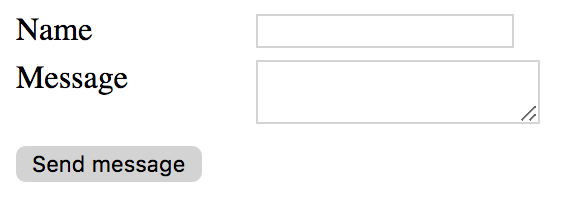
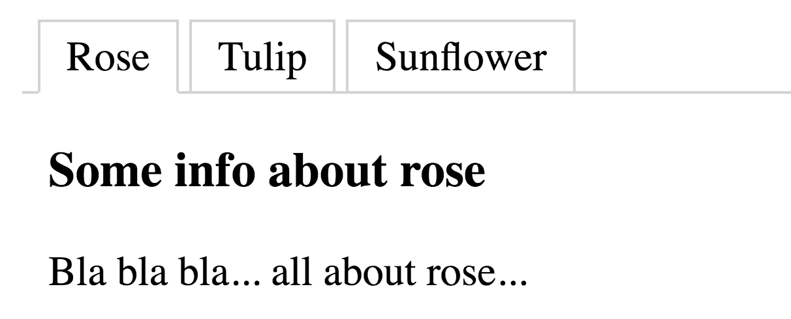
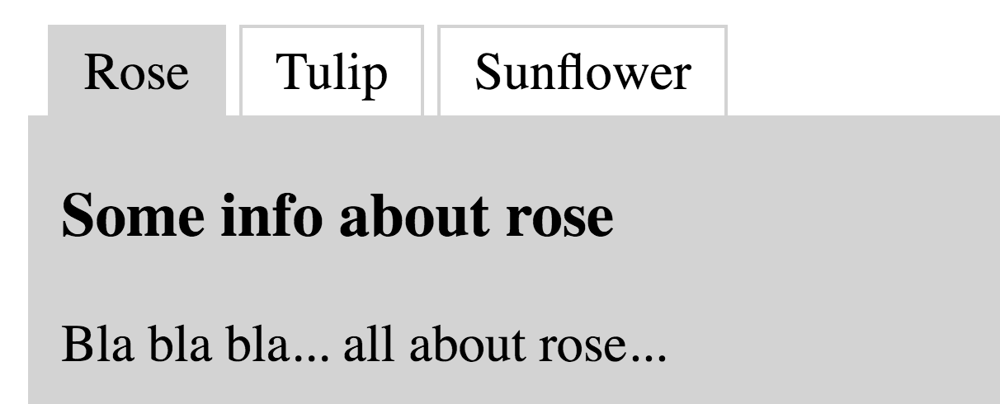
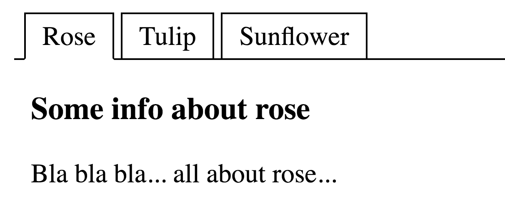
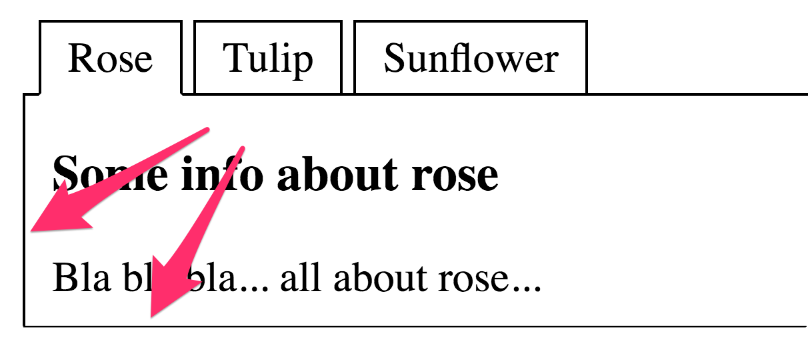

# Colour contrast for user interface components

**"User Interface (UI) components" are interactive elements, ranging from simple buttons and input fields to complex UI widgets. Just as for text there is a general minimal contrast level that needs to be reached to make their functionality and content accessible.**

[[toc]]

## Minimal contrast ratio

Version 2.1 of the Web Content Accessibility Guidelines (WCAG) specify a [minimal contrast ratio of `3:1` against adjacent colour(s) for all UI components](https://www.w3.org/TR/WCAG21/#non-text-contrast).

## Example: form controls

The following screenshot shows a very simple contact form.

The borders of the input fields have an insufficient contrast ratio of `1.5:1`. Because of that, certain users may have a hard time finding the input fields and enter information. 

The background colour of the "Send message" button also has a low contrast ratio (again, it is `1.5:1`). This will make it harder to identify the button by its typical shape. However, the button label adds a lot of valuable information, making this case less urgent or even negligible: it has sufficient contrast, it offers a clear invitation to interact by using a verb (which is better than a generic "OK") and its visual appearance (font, size) is different from the other text elements surrounding it.

## Example: tablists

Tablists convey visually that there is a list of items, and that the content for the currently active item is displayed below. The button-like appearance of the tabs indicates that a user can select them to display their associated content. In the overall visual arrangement the active tab is put "in front" of the inactive tabs, indicating that only one tab can be selected at a time (unlike other visual patterns such as tags or labels).

The borders of the following tablist have insufficient contrast (`1.5:1`). Users who can't see them might not realise how the different pieces relate to each other and that they can interact with them.

Sometimes, tablists rely on background colours instead of borders to indicate their state and functionality. Although this may look much more obvious, it doesn't solve the problem because the contrast is still the same.

On the other hand, borders with high contrast make the tablist recognisable for all users:

And while we are at it: providing clear indicators for where an element starts and where it ends is always good style, so please also expand borders around the content area.

## Exceptions

- **Text:** For text in UI components (like labels) the same requirements apply as for text in content *unless* the whole component is disabled. (see [chapter about colour contrast for text](/knowledge/colours-and-contrast/text/))
- **Disabled components:** this could be a disabled text field or button, but also a custom control.
    - Be careful with this one: often, the mere existence of an element conveys something to a user. For example, a form's submit button can be disabled while the user's input is missing (or invalid). If the label and the shape of the button have insufficient contrast, some people might not be able to perceive the button at all. This can cause them to draw the wrong conclusions about the form, for example assuming that it can't be submitted at all.
    - Also, make sure to not mix up `disabled` with `readonly` states.
