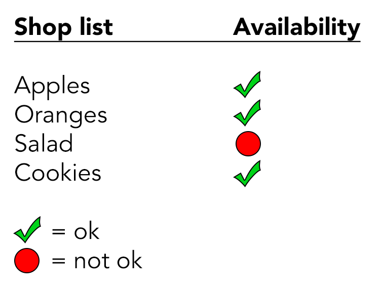

# Contrast requirements of user interface components

**The Web Content Accessibility Guidelines (WCAG) 2.0 only required a certain colour contrast level for text. Finally, the recently published version 2.1 has added colour contrast requirements for user interface (UI) components.**

There is not much value to interactive elements on a page, if a user can not perceive them. Alas, UI components need a contrast ratio of at least `3:1` against adjacent color(s).

## Form controls

For example, if the fields of a contact form have borders with low contrast, a user with low vision may not be able to fill (or even find) them.

In the following screenshot, the fields' borders have a contrast ratio of `1.5:1`.

Strictly speaking, also the submit button is hardly perceivable as a form control: although its label "Send message" is clearly visible, the background color (that should indicate the user that the element is a button) also has a contrast ratio of only `1.5:1`.

## Enhancing contrasts of UI components

In the following example, the availability status of elements in a shop list is indicated using a red or green dot; green standing for "ok", red standing for "not ok".

The red and green colours have a contrast ratio of `2.0:1`, which is not sufficient. Alas, a user with a severe colour deficiancy would not be able to recognise whether an element is available or not.

You could try to fix the problem by experimenting with the colours until you find a combination with enough contrast. But this would probably suffer the visual design - and as additional statuses occur, this quickly becomes a dead-end.

By the way: always be careful with meaning conveyed solely through colour! In other cultures, colours may be used differently to yours. Alas, always offer a legend with descriptive texts so the meaning is independent from cultural backgrounds.

### Adding text information

You could simply add text information to each dot, conveying its status. This would even render the legend obsolete.

In general though, this somehow feels like redundant information.

### Adding shape information

Instead of simply using a coloured dots, we could use a different shape for each status.

In the following example, a tick sign is used for "ok", and a dot for "not ok".

### Adding pattern information

Another possible solution is to use a different pattern for each status.

In the following example, a vertical pattern is used for "ok", and a horizontal one for "not ok".

TODO: "current" icon!!!

TODO: tabliste!!!
