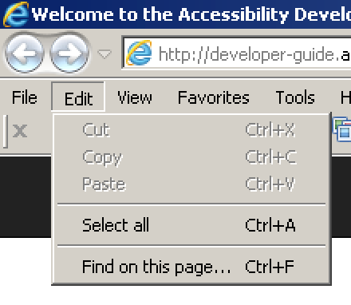

# Controlling a computer with a keyboard only

**Many users control a computer using keyboard only, so no mouse or similar pointing device is available. Thus, it's crucial that any software (including websites) is operable by keyboard only. This does not only benefit disabled users, but also power users.**

[[toc]]

**Notice:** we are talking specifically about Windows operating systems here. For macOS, Linux, and others, there exist similar keyboard shortcuts.

## Why no mouse?

Many users do not use a mouse (or similar pointing device):

- Either they cannot control one due to a motor impairment.
- Or they simply do not want to control one as they are power users (see below).

## Keyboard only navigation

Computers (and all their standard software) can flawlessly be controlled without a pointing device (for example a mouse) by using system wide and application specific keyboard shortcuts and quick keys.

Even for users who are not able to control a common keyboard, there are various special input devices. Sometimes called "switches", they are tailored to the needs of different user groups. The complexity of these devices varies a lot, some of them having only a few buttons. But in general they are "mimicking" default keyboards and offer similar interaction opportunities.

So by making sure that your websites are controllable with a default keyboard, many other special input devices is automatically taken care of. But before we look at how to control a website with keyboard only, it is useful to know the larger context of controlling any arbitrary application on your computer. If you are in a hurry though, you may skip the rest of this page.

### Keyboard shortcuts

Keyboard shortcuts trigger certain functionalities, be it system wide or application specific. Keyboard shortcuts usually are combinations of at least one modifier key (`Windows`, `Ctrl`, `Alt`, `Shift`) and any other key.

- System wide keyboard shortcut example: `Ctrl + Alt + Del` opens the Windows Task Manager.
- Application specific keyboard shortcut example: `Ctrl + S` saves the currently opened document (for example in a text editor).

Hints about application specific keyboard shortcuts usually are displayed to the right of a menu item.

### Quick keys

In some menus, a specific character of an item name is __underlined__: if the menu is open and focused, this means you can quickly activate the item using this key.

## Becoming a power user (optional)

Power users know and use their often used applications' keyboard shortcuts: it makes them much faster than average users, as they do not need to switch between keyboard and mouse all the time.

This is a good example for the fact that optimising a website for one particular group (for example motor impaired users), you often also optimise it for other groups (for example power users). A win-win situation.

For the future, we suggest you try to use keyboard shortcuts instead of your mouse. This way, you will automatically test your own implementations for keyboard only accessibility while developing them.

### More keyboard shortcuts

For some more inspiration, find here additional system-wide and application-specific keyboard shortcuts. If you know and use all of them by heart, you can officially call yourself a power user!

#### System wide shortcuts

The following is a collection of some well known shortcuts (in no specific order).

- Press `Windows` to toggle Start menu
- Press `Alt + Tab` to switch between open windows
- Press `Alt` to focus current windows' application menu
- Press `Tab` to jump between focusable controls
- Press `Enter` to confirm something (for example closing a dialog and applying changes)
- Press `Space` to also confirm or interact with stuff (often used interchangeably with `Enter`)
- Press `Esc` to cancel something (for example closing a dialog without applying changes)

Notice: by pressing `Alt`, the focus is placed in the current application's menu (if available). Using the arrow keys, you can then browse it. The focused item can be activated by pressing `Enter`.

#### Application specific shortcuts

Most of the following shortcuts are pretty common to a wide set of similar applications:

- `Ctrl + S`: Save
- `Ctrl + O`: Open
- `Ctrl + T`: Open tab
- `Ctrl + W`: Close window (or tab)
- `Alt + F4`: Exit application
- `Ctrl + C`: Copy
- `Ctrl + V`: Paste
- `Ctrl + F`: Find

This list by far is not complete, and each application may offer very distinct additional shortcuts.

## You could also be interested in

Knowledge is power! Our guide has more to offer about:

- [How to browse websites using a keyboard only](/knowledge/keyboard-only/browsing-websites/)
- [How to implement websites that are ready for keyboard only usage](/knowledge/keyboard-only/how-to-implement/)
- [Relevant combinations of screen readers and browsers](/knowledge/screen-readers/relevant-combinations/)
