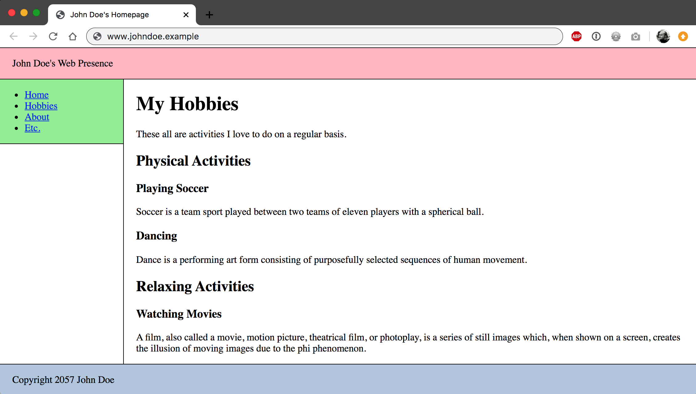
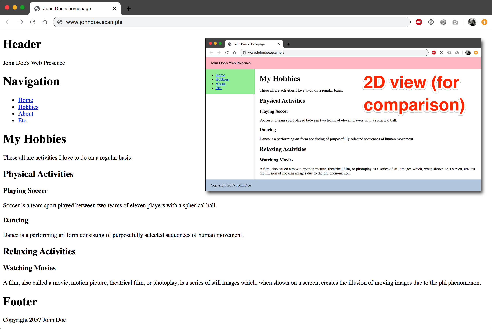
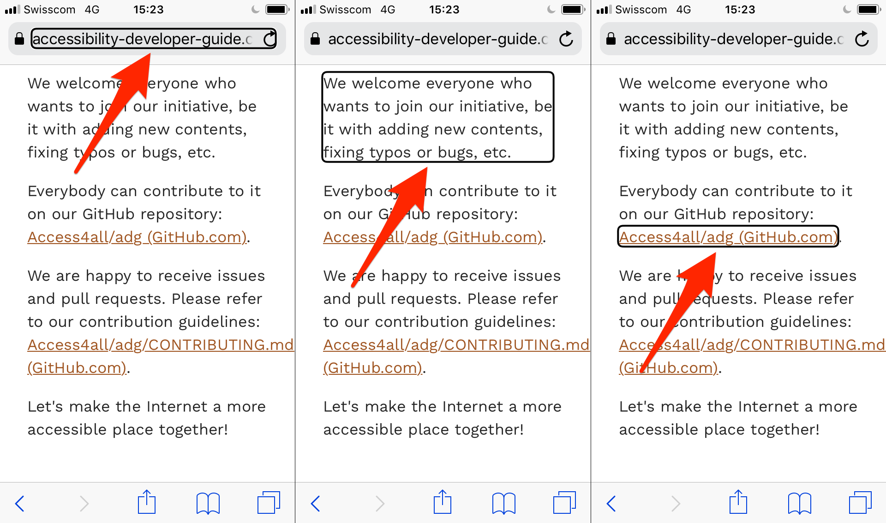
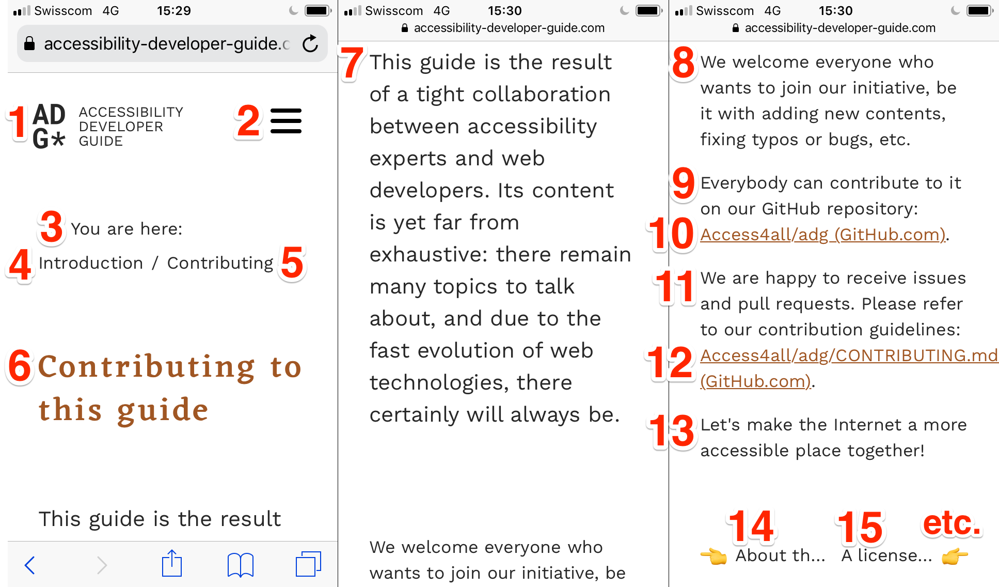
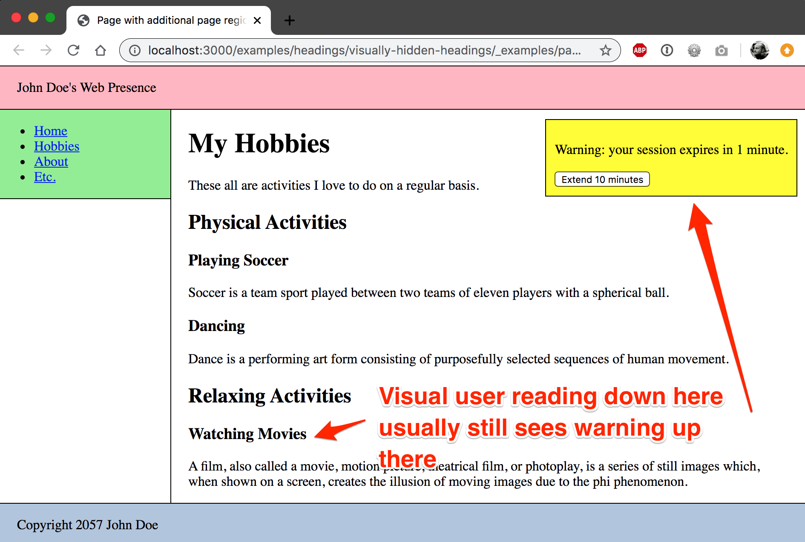
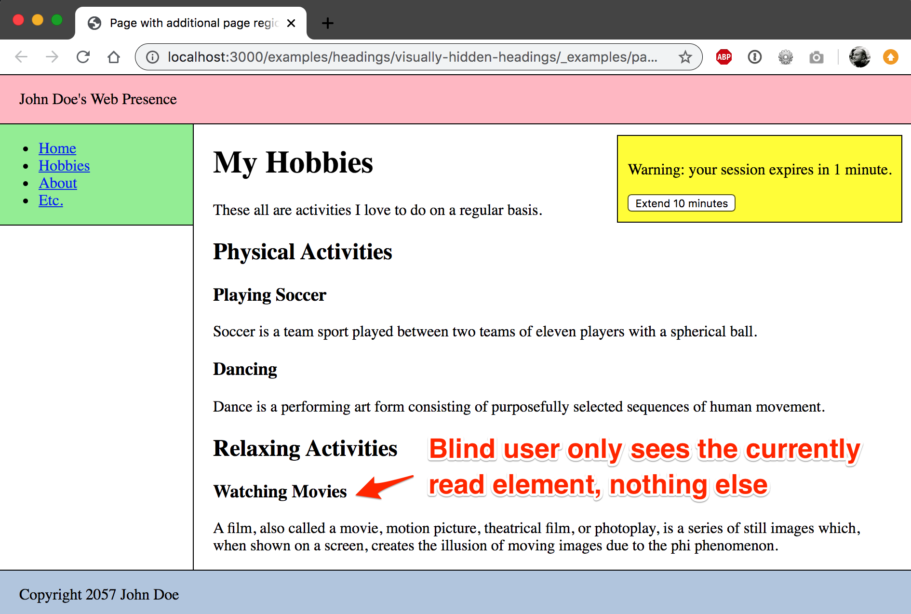

# Screen readers process contents in a linear way using a cursor

**Sighted users perceive a webpage as a two-dimensional, graphical area. Meanwhile, screen reader users perceive a page in a one-dimensional (linear), textual way: one element after the other, from top to bottom. Similar to reading a book, browsing websites in this way is usually considerably slow, as a lot of time is needed to get a proper overview of a full page.**

[[toc]]

## Visual perception: graphical area (two-dimensional)

Sighted users using a traditional display perceive a page in its full two-dimensional layout.

Within fractions of a second, the users perceive the different areas of a page and interprete them intuitively, for example:

- Header (typically on top with a logo)
- Navigation (typically part of the header or on the left side)
- Main content (typically the biggest area of the page, enclosed by the other areas)
- Footer (typically at the bottom)
- Etc.

## Auditive perception: linear text (one-dimensional)

Blind users using a screen reader perceive a page in a linear, one-dimensional way. Like a traditional book (or better, an audiobook), a page is scanned by the screen reader sequentially from top left to bottom right, line by line.

This is due to the nature of written (and spoken) information: it is presented in a purely linear, sequential fashion, one line after the other, approximately like this:

As such, a screen reader can place its cursor (i.e. it can "look") on only one single line of the whole content at a time.

### Screen reader cursor vs. browser focus

The screen reader's cursor is somewhat similar to the browser's focus. But while the browser's focus can only be set to focusable elements (like links and form elements), the screen reader's cursor reaches all elements (even headings, paragraphs, etc.).

For example, in VoiceOver/iOS the cursor paints a black border around the current object; it looks like this:

### Auditive announcement of elements

The screen reader always reads aloud the information fragment on which its cursor currently is placed. The cursor can be moved by the user to the next (or previous) element, which then again is announced by the screen reader. The [DOM](https://en.wikipedia.org/wiki/Document_Object_Model) is used to determine the sequence of the elements.

This way, users move their cursor through the whole document, from the very top to the very bottom - or until they find the information they are looking for.

In many cases, this means that screen reader users need a lot more time to browse a webpage than visual users do. Especially when browsing a website for the first time, screen reader users have to manually get a general idea of its layout and contents.

The more a user has accustomed to a website though, over time, they will work out quicker ways of navigating between blocks of information.

### Observation of content changes

While looking at a page, visual users usually notice any change that may happen to some element, as long as it is in their field of vision. For example, a warning suddenly appears on the top right corner of the screen, saying: "Your session expires in 1 minute". Visual users usually notice something like that automatically, regardless what exactly they are looking at in the content.

To screen readers users, such a change to the page can potentially only be observed if their cursor is placed on the element in question. Changes to any other elements generally are not observed and thus not conveyed to users. In the example above, screen reader users will simply loose their session, without ever knowing that there had been a well-meant warning.

To handle situations like this, there are ways to tell screen readers to observe specific elements for changes; so if you are really curious and want to learn more about this, skip ahead and read [How to implement websites that are ready for screen reader usage](/knowledge/screen-readers/how-to-implement).
