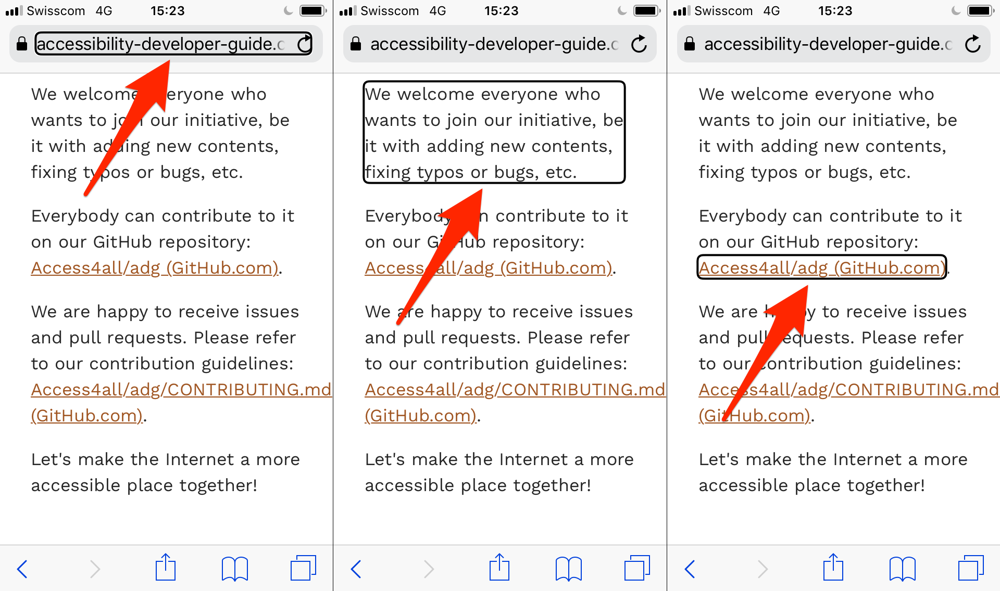

# Screen readers process contents in a linear way

**Sighted users perceive a webpage as a two-dimensional, graphical area. Meanwhile, screen reader users perceive a page in a one-dimensional (linear), textual way: one element after the other, from top to bottom. Similar to reading a book, browsing websites in this way is usually considerably slow, as a lot of time is needed to get a proper overview of a full page.**

## Visual perception: graphical area (two-dimensional)

Sighted users using a traditional display perceive a page in its full two-dimensional layout. Within fractions of a second, the users perceive the different areas of a page and interprete them intuitively, for example:

- Header (typically on top with a logo)
- Navigation (typically part of the header or on the left side)
- Main content (typically the biggest area of the page, enclosed by the other areas)
- Footer (typically at the bottom)
- Etc.

## Auditive perception: linear text (one-dimensional)

Blind users using a screen reader perceive a page in a linear, one-dimensional way. Like a traditional book (or better, an audiobook), a page is read aloud by the screen reader sequentially from top left to bottom right: character by character, word by word, sentence by sentence; or content element by content element.

This is due to the nature of spoken information: it is presented in a purely linear, sequential fashion, one word after the other. As such, a screen reader can place its cursor (i.e. it can "look") on only one single position in the whole page at a time.

For example, in VoiceOver/iOS, the cursor looks like this:

While in NVDA, the cursor looks like this:

This is somewhat similar to the focus of traditional browsers; in fact, when the screen reader cursor reaches a focusable element, the element's focus state usually is triggered, too.
      - But while the browser focus can only be set to focusable elements (like links or form elements), the screen reader's cursor reaches all elements on the website.
- The screen reader reads aloud the information fragment on which its cursor currently is placed.
    - Depending on how the user navigates, typically either a full line of text, a word, or a single character is announced.
    - The position of the cursor can then be moved by the user to another information fragment (for example from one line of text to the next one, or from one word to the next one), each of which then is announced by the screen reader.

This way, users typically move their cursor through the whole document, from the very top to the very bottom - or until they find the information they are looking for. In many cases, this means that screen reader users need a lot more time to browse a webpage than visual users do.

## Observation of content changes

While looking at a page, visual users usually notice any change that may happen to some element. For example, a red container suddenly appears on the top right corner of the screen, containing the warning "Your session will expire in 1 minute, please extend". Visual users will usually notice something like that automatically, regardless what exactly they are looking at.

To screen readers, such a change to the page can potentially only be observed if their cursor is placed on the element in question. Changes to any other elements generally are not observed and thus not conveyed to users. In the example above, screen reader users will simply loose their session, without ever knowing that there had been a well-meant warning.

To handle situations like this, there are ways to tell screen readers to observe specific elements for changes; so if you are really curious and want to learn more about this, skip ahead and read [How to implement websites that are ready for screen reader usage](/knowledge/desktop-screen-readers/how-to-implement).
