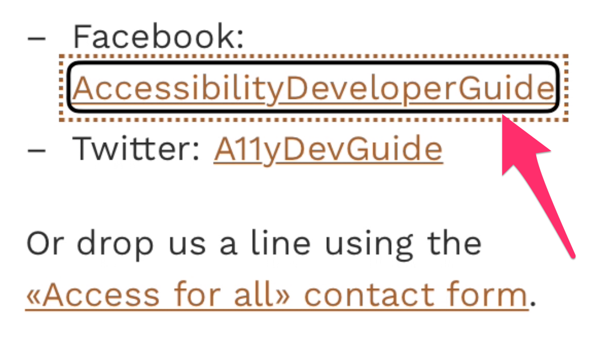
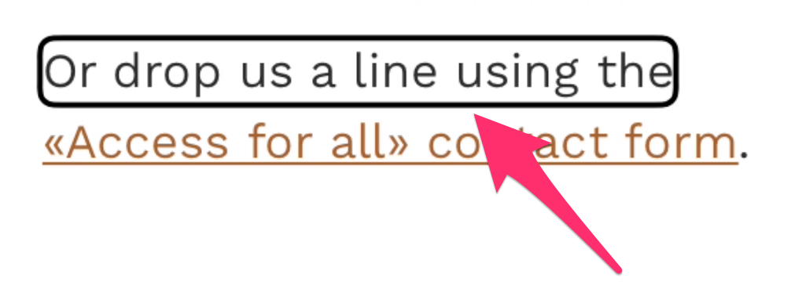

# Mobile screen readers

**Mobile screen readers are easy to understand and control. They offer a quick and pretty robust way of testing websites on accessibility. As they are pre-installed on any modern smartphone, they are the perfect testing tool - especially for beginners.**

Mobile screen readers are controlled pointing and using gestures on the touch screen. While there are pretty advanced gestures for native applications, fortunately the interaction with websites is surprisingly easy.

## The cursor

When a mobile screen reader is running, a "cursor" (a distinctive border) is painted around the currently focused element.

In VoiceOver/iOS it looks like this:

In Talkback it looks like this:

This is somewhat similar to the "focus" of traditional browsers. But while the focus can be set to focusable elements only, the screen reader's cursor reaches all elements on the website, for example plain text paragraphs:

## Navigating

### Left/right gestures

Navigation with mobile screen readers is very easy: by swiping right (or left), the cursor is moved to the next (or previous) element. The DOM sequence is used to determine the next (or previous) element.

Whenever the cursor is placed on a new element, the element is announced:

- For plain text, this is only the text content (like `or drop us a line...` in the screenshot above).
- For other elements, this is also their text content (if available), together with additional information (like `AccessibilityDeveloperGuide (link)` in the screenshot above).

This is the default way of navigating.

### Pointing

You can set the cursor to an element by clicking on it. Advanced mobile screen reader users know exactly where the elements are displayed on their screen and access them quickly this way.

This behaviour usually is confusing to new users, as they expect that pointing on an element would activate (click) it.

### Scanning

If you move your finger over the touch screen, any element below your finger will receive the cursor. This is a good way to scan the screen and browse for elements.

## Activating

## Interacting

## On-screen keyboard (iOS)

## Rotor (iOS)

(Test Josh)
