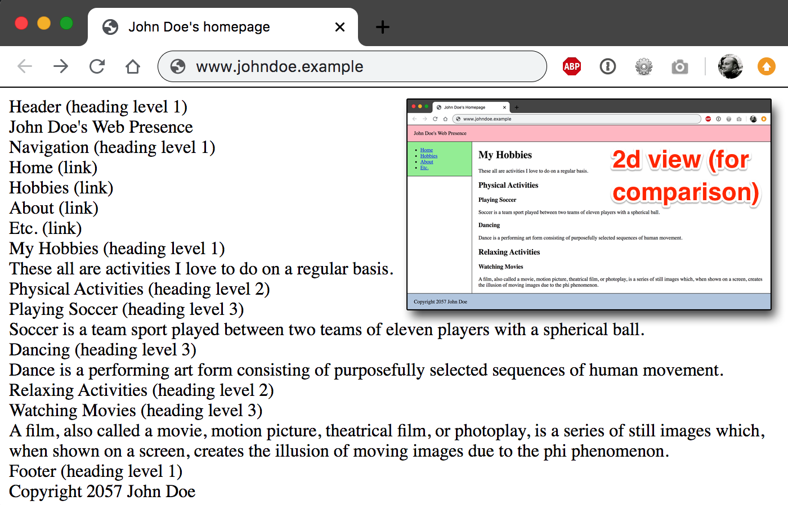

# Screen readers do not convey visual attributes

**Similar to the reading of a traditional book, screen readers only announce plain content, enriched with semantical information. Visual attributes are totally ignored. Interestingly, some CSS still does have influence on screen readers.**

[[toc]]

Screen readers do not announce visual attributes of elements (for example a text's `font-size`, `text-decoration`, or `color`). Only plain text enriched with semantical information (for example "heading level 3" or "link") is announced by them.

So if you haven't done this yet, go back and read [Semantics and their importance for accessibility](/knowledge/semantics).

## Disabled CSS == screen reader? Wrong.

_**Or:** Does a webpage with disabled CSS correspond to how a screen reader perceives it? No, it does not._

Some resources propose disabling CSS in the browser for accessibility testing, holding the opinion that this should provide a sort-of-similar view to the one of a screen reader.

But even if this may give a rudimentary feeling of what the website "looks" to screen readers, it's by no means identical to their output! First of all, when disabling CSS, images are still visually perceivable, and not replaced with their alternative texts (`alt` attribute or `<figcaption>` element), like screen readers do. And then, there are some CSS rules that in fact have a critical influence on what information is perceivable by screen readers (and how it is perceived). So disabling CSS usually has fundamentally diverging impacts compared to how screen readers announce a webpage.

Most of all, special attention needs to be paid to the different values of the `display` attribute:

- Some can hide elements from screen readers (if you are really curious and want to learn more about this, skip ahead and read [Hiding elements correctly](/examples/hiding-elements)).
- Some can change the way how screen readers split blocks of information.
- Some can change the role of an element (if you are really curious and want to learn more about this, skip ahead and read [Responsive tables](/examples/tables/responsive)).
- Fiddling around with the `content` attribute and pseudo elements (like `::after`) sometimes may have unexpected side effects.

So if you know its shortcomings, disabling CSS sometimes can be a useful "poor man's screen reader substitute". But it will never be a real replacement for a real screen reader - not at least because of still delivering a two-dimensional output (instead of a one-dimensional one).
