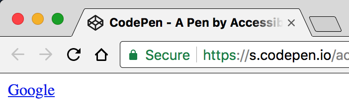
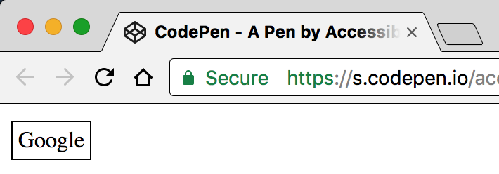

# Semantics support interaction

**Semantic HTML does not only provide meaning to content elements, it also provides the foundation for elements' interactivity. Be it links, buttons or various form inputs - browsers know exactly how to deal with them, and they provide the user with everything needed for proper interaction with the website.**

[[toc]]

## Standard functionality is good

Let's look at this topic based on the example of the tag that made the internet what it is today: the hyperlink.

As you can see, the following link is properly implemented using the `<a>` tag:

```html
<a href="http://www.google.com">
  Google
</a>
```



A visual user agent (web browser) displays the element underlined to indicate it being a link.

An aural user agent (screen reader) announces the element as:

> Google: link

Both visual and aural presentation provide identical results to the user. Additionally, the link can be activated so the target page is loaded, all provided automatically. Thanks to standards.

## Custom functionality is bad

Many web developers still aren't aware of the importance of semantics and do not use them for various reasons. For example, to prevent default link styles, instead of using the proper `<a>` tag, an inventive developer may have come up with something like that:

```css
.link {
  border: 1px solid black;
  padding: 4px;
}

.link:hover {
  cursor: pointer;
}
```

```html
<!-- Onclick would change window.location using some fancy JavaScript! -->
<span class="link" onclick="...">
  Google
</span>
```



In this case, while the visual presentation usually is adapted to pretend a link to the user, screen readers won't announce the element as a link. So the user probably will never try to click it. Admittedly, some screen readers may announce it as "clickable", but this still does not say much about the purpose of the element.

In addition, the element won't be usable using a keyboard only: while a proper `<a>` tag can be focused, a `<span>` cannot. Sure, you could also find a way around this, but chances are high you will always forget about manually addressing some lesser known features of the tags you try to reconstruct - for example, what about browser history support?

Gimmicks like this can destroy the experience for lots of users and often create limits beyond remedy for them. So please: simply use the proper tags in the first place!

## Conclusion: standard over custom!

As we have seen, adding proper standard HTML helps screen readers to announce elements in such a way that their users know how to interact with them. Additionally, HTML is the foundation for a lot of inherent standard functionality that is provided "for free" by the browser. That means that it just works for all kinds of devices.

Many of today's problems regarding accessibility are linked to developers not being aware of the most basic HTML fundamentals. Caring for proper semantics will make you a so much more exquisite frontend developer than you could ever imagine. Trust us.