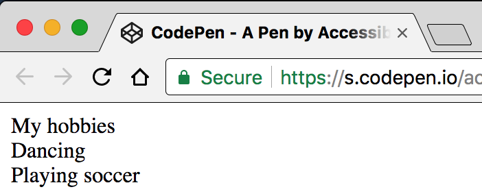
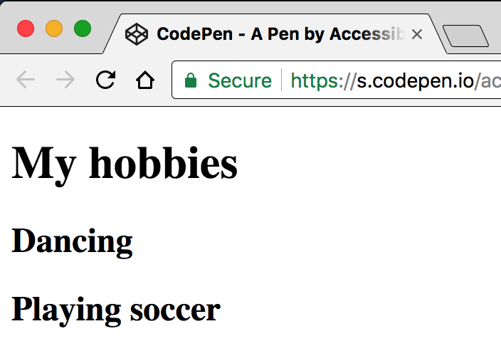
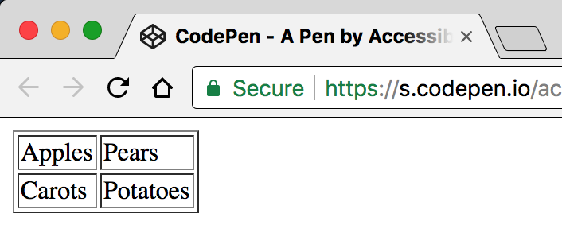

# Semantics provide meaning

**Not surprisingly, HTML (Hyper Text Markup Language) is exactly that: a markup language. This means that it is not only plain text, but text marked up with meaning - so called "semantics". For this, HTML offers a lot of tags, each with an inherent, unique semantic meaning. And it is absolutely crucial that those tags are used properly.**

[[toc]]

## Tags with no meaning

To understand the importance of proper semantics, let's first look at the exceptions: tags that indeed do not provide semantical information.

There are only two tags in HTML that do not have any semantic meaning: `<div>` and `<span>`. Their purpose is to offer containers needed for visual styling. And their only difference is that `<div>` is a block element, while `<span>` is an inline element.

Take a look at the following example:

```html
<div>
  My hobbies
</div>

<div>
  Dancing
</div>

<div>
  Playing soccer
</div>
```

A visual user agent (web browser) displays such elements' text contents (if any) in their standard font size, line height, color, etc.



An aural user agent (screen reader) simply announces such elements' text contents (if any). This will simply be announced as:

> My hobbies
>
> Dancing
>
> Playing soccer

In this case, both visual and aural presentation provide identical results to the user.

## Tags with meaning

### Content elements

Content elements are used to give meaning to content (like headings, paragraphs, or links).

Let's take a look at the same example, now marked up using heading tags (`<h1>`, `<h2>`, etc.):

```html
<h1>
  My hobbies
</h1>

<h2>
  Dancing
</h2>

<h2>
  Playing soccer
</h2>
```

Marking up text using an `<h#>` tag tells the user agent that this is not just plain text, but - in fact - a heading of a certain level!

A web browser conveys this additional information visually by increasing the element's font size, line-height and boldness (depending on the heading's level).



A screen reader conveys this additional information by announcing the element's meaning:

> My hobbies: heading level 1
>
> Dancing: heading level 2
>
> Playing soccer: heading level 2

In this case, while visual and aural presentation may feel quite different, the provided information essentially remains identical: both dancing and playing soccer are clearly identifiable as hobbies.

### Structural elements

Structural elements are used to group elements on a webpage, separating them into different regions (like header, navigation, main, or footer). They have been introduced in HTML 5.

For our example, we could enclose everything into a `<main>` container, separating it from other potential regions like `<header>` or `<footer>` on the page.

```html
<header>
  <!-- Content like logo, link to start page, etc. -->
</header>

<main>
  <h1>
    My hobbies
  </h1>

  <h2>
    Dancing
  </h2>

  <h2>
    Playing soccer
  </h2>
</main>

<footer>
  <!-- Content like disclaimer, contact info, etc. -->
</footer>
```

Screen readers recognise these containers, announce them to the user and offer additional features for navigating between them.

## Typical problems

### Missing semantics

It is very important to acknowledge that while visual attributes are displayed in web browsers, screen readers do not care about them. Regardless whether text has `color: blue` or `color: red`, whether it is `font-size: 1px` or `font-size: 100px`, whether it has a `border` or a `text-shadow`, it's always announced as plain text. Only if it is semantically marked up, screen readers do care (if you are really curious and want to learn more about this, skip ahead and read [Screen readers do not convey visual attributes](/knowledge/screen-readers/no-visual-attributes)).

Let's now look at the following example, where the developers may not have felt like overriding default browser styles. So they decided to avoid real headings and just apply some visual attributes to meaningless containers:

```css
.h1 {
  font-size: 20px;
}

.h2 {
  font-size: 17px;
}
```

```html
<div class="h1">
  My hobbies
</div>

<div class="h2">
  Dancing
</div>

<div class="h2">
  Playing soccer
</div>
```

In this case, while visual presentation may look like proper headings, screen readers won't announce them as such. The provided information is by no means identical: screen reader users are left behind, as the contents are in no identifiable relation to each other. More precisely: they will simply understand that there are hobbies, there is dancing, and there is playing soccer (but not necessarily that dancing and playing soccer are hobbies).

### Wrong semantics

Another problem that occurs a lot is wrong semantics.

Let's have a look at the following example, where the developers strived for higher rankings in search engines. They decided to use only headings on level 1 and just override some visual attributes for lower levels:

```css
.h2 {
  font-size: 17px;
}
```

```html
<h1>
  My hobbies
</h1>

<h1 class="h2">
  Dancing
</h1>

<h1 class="h2">
  Playing soccer
</h1>
```

In this case, while visual presentation may still look like proper headings, screen readers will only announce headings on level 1! Again, the provided information is not identical: screen reader users will have trouble to relate the different headings to each other properly. More precisely: again, they won't know that dancing and playing soccer are meant to be hobbies.

Needless to say that today's search engines know about such trickeries and penalise them.

### Invalid syntax

Human languages have pretty strict sets of rules to create well-formed sentences. Computer languages have even stricter rule sets: this is called "syntax". Most computer languages are extremely strict, especially programming languages: if the syntax of a piece of code is not 100% valid, the computer will not understand it.

Being an implementation of "eXtensible Markup Language" (XML), HTML also has very strict rules. But because HTML is a markup language, and they are much easier to understand by computers than programming language. Alas, web browsers are capable of fixing a lot of typical syntax problems in HTML code, and as such are pretty forgiving with invalid HTML syntax. This in general is a good thing - and one of the basic fundamentals of the internet, as it allows everybody (including non-professionals) to participate in the worldwide exchange of knowledge.

For example, the following table is coded extremely bad:

```html
<table border=1>
  <td>Apples
  <td>Pears
<tr>
  <td>Carots
  <td>Potatoes
```

- There is no `<tr>` tag for the first row
- All closing tags are missing
- The value of `border` has no quotes

However, most browsers still visually render it correctly.



When inspecting the DOM, it is evident that the browser internally tried to fix the bad structure: all closing tags are there, the border width of `1` could be parsed successfully without quotes, and even an additional `<tbody>` element was added (which is optional here).


Still, HTML is a very strict standard and must be coded correctly to be truly valid. And because invalid syntax usually leads to missing or incorrect semantics, screen readers are much more dependent on valid HTML code. So mistakes like the ones above often lead to big problems.

## Conclusion: semantics over presentation!

The example above is artificial and does not have any real content, so it may not seem very drastic. But real websites often feel like an unmitigated mess (or a textual tapeworm) to screen reader users because of missing or wrong semantics and invalid syntax.

In addition to this, proper semantics allow the user to navigate content quickly. For example by skipping the current list of links, or by jumping from heading to heading to get an overview of the webpage's contents. This provides the opportunity to choose which content should be digested, improving the general user experience a lot.

So to create accessible websites, it is highest priority to provide correct semantics, while presentation always has lower priority. Please live with that.

By the way, there are a lot of automated test tools that help preventing many of the problems described above, for example [TotalValidator](/setup/helper-tools/totalvalidator).
