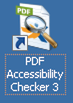
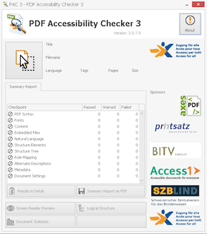

# PDF Accessibility Checker

{.image}

# Installation

[Download PDF Accessibility Checker](http://www.access-for-all.ch/en/pdf-lab/pdf-accessibility-checker-pac.html).

As it doesn't have an installer, you can simply extract it to a folder of your liking.

# Usage

{.image}

After launching it, examine a PDF document by clicking the `Select PDF File` symbol: {.image}.

Inspect the displayed results.

To ensure the PDF's content is marked up and the elements are ordered meaningfully, open the `Screen Reader Preview`.