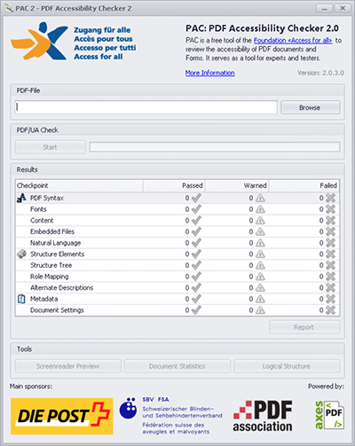

# PAC: PDF Accessibility Checker (Win)

{.image}

The Matterhorn Protocol (PDF) is designed to foster adoption of PDF/UA by providing a set of 31 checkpoints and 136 failure conditions that help software developers exchange detailed information on PDF/UA conformance and create software to make it easier for document authors to create fully accessible PDF files and forms.

# Installation

Download [PDF Accessibility Checker](http://www.access-for-all.ch/ch/pdf-werkstatt/pdf-accessibility-checker-pac/download-pac.html) and install it.

# Usage

TODO