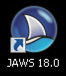

# JAWS screen reader: installation and configuration

{.image}

Due to historical reasons and for its good compatibility to various office software, JAWS still is the most used screen reader world wide.

Unfortunately, JAWS is quite expensive to buy. But there is a demo version you can download for free with limited runtime. You must restart your computer to reset the timer after 40 minutes of use. Another good reason to set up your accessibility testing environment as a virtual machine (see [Virtual testing machine](/section--setting-up-the-accessibility-testing-environment---introduction/virtual-testing-machine){.page}).

For more info, see [Relevant combinations of screen readers and browsers](/knowledge-about-developing-and-testing-accessible-websites/introduction-to-desktop-screen-reader-usage/relevant-combinations-of-screen-readers-and-browsers){.page}.

# JAWS installation

- [Download JAWS](http://www.freedomscientific.com/Downloads/JAWS)
- Install it (see [JAWS Quick Start (PDF)](http://www.freedomscientific.com/Content/Documents/Manuals/JAWS/JAWS-Quick-Start-Guide.pdf))

# Starting JAWS

{.image}

- Simply start JAWS using its icon on the desktop (or `jfw.exe` in its installation folder: `Freedom Scientific\JAWS\18.0\jfw.exe`)

# JAWS configuration

## Run from system tray

- To save space in the taskbar, JAWS should run in the system tray
- In JAWS, open `(Options)` → `(B)asics`
- Select `Run JAWS from (S)ystem Tray`
- Click `OK` and restart JAWS
- From now on, you can access the JAWS features through `JAWS + J`
    - By default, the `JAWS` key is the `Insert` key (see [Screen readers are keyboard shortcut monsters](/knowledge-about-developing-and-testing-accessible-websites/introduction-to-desktop-screen-reader-usage/screen-readers-are-keyboard-shortcut-monsters){.page})

# Braille viewer

{.image}

- JAWS doesn't offer a `Speech Viewer` like NVDA, but at least its `Braille Viewer` gives some basic info about where JAWS' focus is at the moment
- More info here: [Re: Any JAWS equivalent to NVDA "Speech Viewer"?](http://webaim.org/discussion/mail_message?id=22894)
- Be warned that the braille viewer sometimes isn't perfectly in sync with JAWS' audio output
    - In general, the braille viewer is more accurate though (TODO: we should provide some more explanations here!)

# Speech history

{.image}

- Sometimes it's interesting to see what JAWS announced in the past (or to copy&paste some output)
- To open the output history, press `JAWS + Space`, then `H`
- The history shows that last 20 announcements
- Sadly, the history doesn't refresh automatically