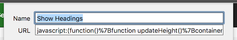

# Bookmarklets

**Bookmarklets are bookmarks that contain some JavaScript instead of a URL. You can execute them while reading a webpage, and they typically do some quick analysis and display their results.**

## Installation

Bookmarklets can be installed by dragging the specified link to your bookmarks toolbar. If you are not able to drag and drop, copy the link location, create a bookmark manually, and paste the copied code as URL.

We suggest you add all suggested bookmarklets to each and every browser you have (you never know when you need them).