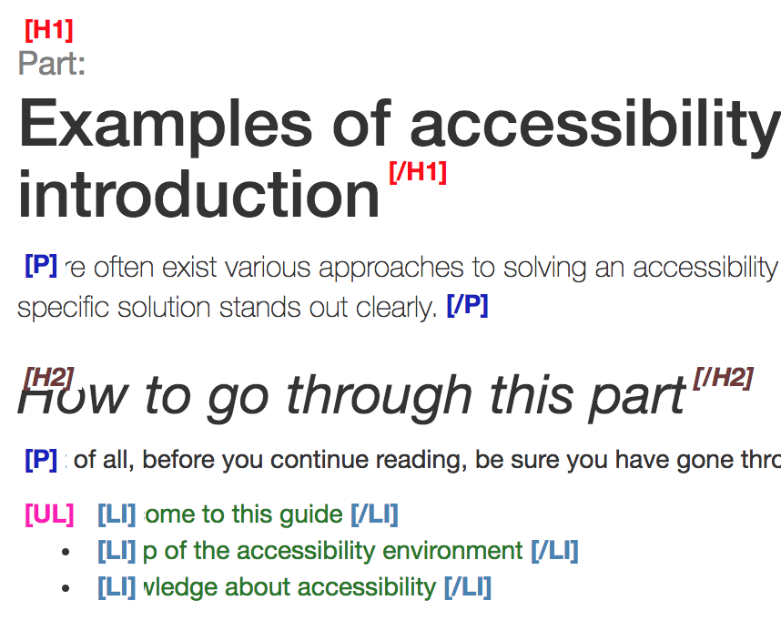

# Contents Structured

**This bookmarklet highlights a lot of typical semantic HTML elements, conveying their tag names. This makes inspection of the current page's semantic structure pretty easy.**

[[toc]]

## Installation

Go to [bookmarklet.html](_static/bookmarklet.html) and get the bookmarklet there.

## Usage

Activate the bookmarklet by clicking on it. Then inspect the displayed results and make sure the used tags are semantically meaningful.

## Credits

This is a slightly enriched version of the bookmarklet [Inhalte gegliedert](http://testen.bitv-test.de/bookmarklets.html). Our version highlights some more elements like lists, tables, links, and forms.
