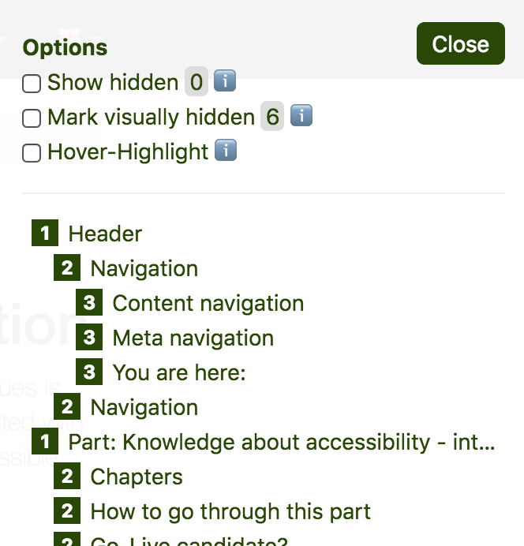

# h123

**This bookmarklet provides an efficient way to display the current webpage's heading outline, very close to how screen readers do. In addition, it has some pretty useful features like displaying potentially incorrectly hidden headings.**

[[toc]]

## Installation

Go to [hinderlingvolkart.github.io/h123](https://hinderlingvolkart.github.io/h123) and get the bookmarklet there.

## Usage

Activate the bookmarklet by clicking on it. A popover outlining the page's heading structure is then displayed on the top right of the page.

The popover has some very useful options and features:

- Activate "Mark visually hidden" to see which of the present headings are visually hidden (moved out of the viewport).
- Activate "Show hidden" to also display headings that are completely hidden.
    - This is useful for debugging headings that may have been completely hidden unintentionally.
- Activate "Hover-Highlight" to visually display the heading that corresponds to the element highlighted by the mouse cursor.
    - This is useful for debugging whether the current heading outline is sensible: each and every element on the page must belong to a proper heading.

The bookmarklet supports both native `<h#>` tags and `role="heading" aria-level="..."` elements.
