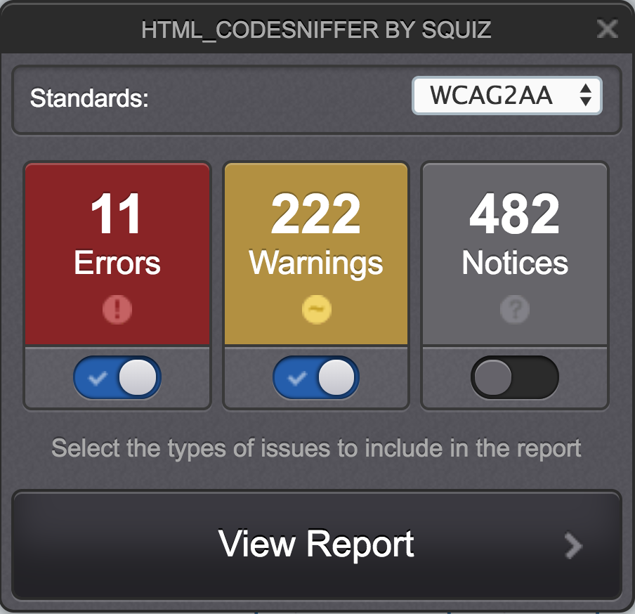

# HTML_CodeSniffer

**This bookmarklet analyses the displayed page's HTML source and detects violations of the coding standard. It offers a huge amount of predefined rules and can be extended with custom rules.**

[[toc]]

## Installation

Go to [HTML_CodeSniffer](http://squizlabs.github.io/HTML_CodeSniffer/) and get the bookmarklet there.

## Usage

Activate the bookmarklet by clicking on it. Then inspect the displayed results.

### Discretion advised

In general, be careful with the displayed results. Automated test tools are very limited and tend to display both false-positive as well as false-negative results.