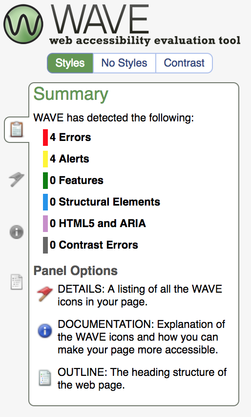

# WAVE toolbar

**WAVE toolbar gives you a very quick first impression about the quality of the current webpage's accessibility. At the press of a button, it provides visual cues by injecting icons and detailed information right into the page.**

[[_TOC_]]

## Installation

[Download WAVE Evaluation Tool for Chrom](https://chrome.google.com/webstore/detail/wave-evaluation-tool/jbbplnpkjmmeebjpijfedlgcdilocofh) and install it. 
[Download WAVE Evaluation Tool for Firefox](https://addons.mozilla.org/de/firefox/addon/wave-accessibility-tool/) and install it.

### Online service

Alternatively, instead of installing it, you can use WAVE's online service at [wave.webaim.org](http://wave.webaim.org/).

## Usage

Activate WAVE by clicking its symbol in the browser toolbar.

.

You will then see icons appear directly on the page. Click on them to get more details.

The most interesting items are the red (error) and yellow (alert) ones.

### Discretion advised

In general, be careful with the displayed results. Automated test tools are very limited and tend to display both false-positive as well as false-negative results.