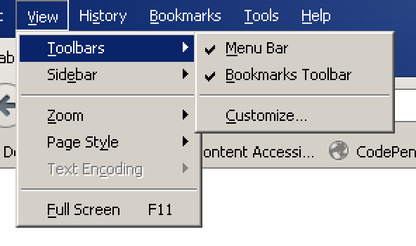

# Firefox installation and configuration

**Being one of the most sympathetic browsers available, Firefox (FF) is widely used and loved by people with special needs, especially technology-adept ones. One of FF's main characteristics is its high conformance regarding web standards, including those related to accessibility.**

[[toc]]

## Installation

The Quantum release of FF is not compatible with screen readers yet: [Can I use my screen reader with the new Firefox? (Mozilla.org)](https://support.mozilla.org/en-US/kb/can-i-use-my-screen-reader-new-firefox).

For the time being, you should [download the Extended Support Release (ESR) of Firefox](https://www.mozilla.org/en-US/firefox/organizations/all/) and install it.

Note: there's also a [portable version](https://portableapps.com/de/apps/internet/firefox_portable) of FF that does not require admin rights.

## Configuration

### Displaying all toolbars

Make sure that in the menu, under `View > Toolbars`, all items are selected.

If you do not see the menu, press the `Alt` key once.

### Restoring tabs after restart

You may open and close browsers repeatedly during accessibility testing. To see how to configure FF to restore tabs upon restart, see [Restore previous session - Configure when Firefox shows your most recent tabs and windows (Mozilla.org)](https://support.mozilla.org/en-US/kb/restore-previous-session).