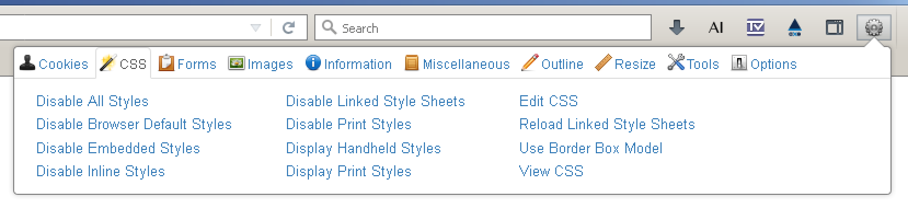

# Web Developer toolbar

**Probably well known by most web developers already, the Web Developer toolbar extension adds various tools to Firefox that are incredibly useful for all sorts of code inspection and debugging. It can sometimes even be seen as a screen reader substitute — if you know its limitations.**

[[toc]]

## Installation

Install the [Web Developer toolbar](https://addons.mozilla.org/de/firefox/addon/web-developer/).

## Usage

Open the features menu by clicking its icon in the browser toolbar.

### Examining elements information

The toolbar comes with tons of features that allow visual inspection of the current page. We mainly use it to quickly examine various information about elements, like alternative text of images using `Images` -> `Display Alt Attributes`, or abbreviations using `Information` -> `Display Abbreviations`.

### Poor man's screen reader simulation

The toolbar can be very useful to visually simulate how a screen reader perceives the current page. This can be achieved by disabling all styles using `CSS` -> `Disable All Styles`.

By removing all visual properties, only bare HTML is left, and the available semantics are easily revealed to visual users (if you are really curious and want to learn more about this, skip forward and read [Semantics and their importance for accessibility](/knowledge/semantics)).

There are some clear shortcomings to this approach though, for example:

- Images are still displayed visually, so be careful that a proper alternative text is present.
    - You can use `Images` -> `Display Alt Attributes` to make up for this.
- Elements that are hidden from all devices using `display: none` or `visibility: hidden`, are now unhidden.
    - To prevent this, instead use HTML's `hidden` attribute to hide elements (if you are really curious and want to learn more about this, skip forward and read [Hiding elements from all devices](/examples/hiding-elements/from-all-devices)).
- ARIA attributes do not have any visual representation and are completely missed this way (if you are really curious and want to learn more about this, skip forward and read [ARIA — when HTML simply is not enough](/knowledge/aria)).
    - To prevent this, keep usage of ARIA to a minimum (if you are really curious and want to learn more about this, skip forward and read [Sensible usage of ARIA roles and attributes](/examples/sensible-aria-usage)).
- Newly added CSS will not be prevented (for example when interacting with the page through some JavaScript).

So while this is a valid way to quickly get a rough idea about a page, it by far is never a substitute to testing with a real screen reader.