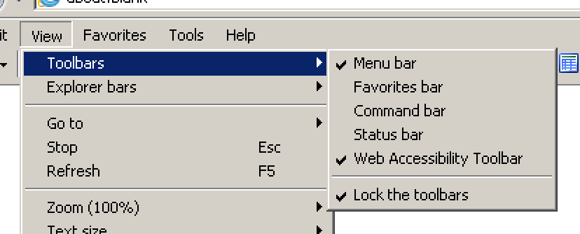

# Internet Explorer 11 installation and configuration

**Microsoft's legacy browser (and every serious web developers' longtime nemesis) Internet Explorer 11 (IE11) keeps on being relevant when it comes to accessibility, as many users with special needs still rely on it. Especially among blind people, Internet Explorer 11 enjoys wide distribution.**

## Installation

[Internet Explorer 11](http://windows.microsoft.com/en-US/internet-explorer/download-ie) is already installed in Windows environments - even on Windows 10, where [Edge](http://windows.microsoft.com/en-US/windows-10/getstarted-get-to-know-microsoft-edge) is the default browser.

If needed, check out [How to locate and open Internet Explorer in Windows 10 (Microsoft.com)](https://answers.microsoft.com/en-us/windows/forum/windows_10-networking-winpc/how-to-locate-and-open-internet-explorer-in/4b067f8b-a0dc-4fba-9e63-00fb14ea82e8). And be sure not to accidentally mix up these two while developing and testing for accessibility!

## Configuration

### Displaying relevant toolbars

Make sure that in the menu, under `View` -> `Toolbars`, at least the following items are selected:

- Menu bar
- Status bar
- Web accessibility toolbar

If you do not see the menu, press the `Alt` key once.

### Restoring tabs after restart

You may open and close browsers repeatedly during accessibility testing. To see how to configure IE11 to restore tabs upon restart, see [Force Internet Explorer to restore last browsing session (TheWindowsClub.com)](http://www.thewindowsclub.com/internet-explorer-restore-last-browsing-session).