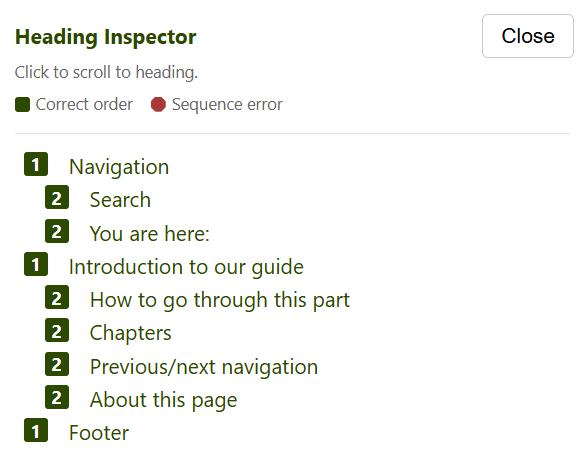

# Heading Inspector

**Unlike similar heading outline tools that parse a page's DOM, this extension reads the accessibility tree directly, catching edge cases—like headings assigned via JavaScript—that DOM-based tools can miss. The Heading Structure extension is built and maintained by [Quantico](https://github.com/quatico-solutions/heading-inspector).**

[[_TOC_]]

## Installation

Go to the [Chrome Web Store](https://chromewebstore.google.com/detail/heading-inspector/adneglmkionfaljjmoaedemiahchfjej) and install the extension.

## Usage

Toggle the heading outline panel for a page with one click on the toolbar icon. The panel will appear on the right side of the viewport.

- The panel lists all headings with their level, indented by depth.
- A green square indicates correct heading order.
- A red octagon indicates sequence errors (e.g. h4 directly after h2) — distinguished by both colour and shape so it is robust under colour-blindness and greyscale.
- Click a heading to scroll to it on the page with a highlight flash.
- Click Close or the extension icon again to hide.
- Follows navigation within the same site. Once you open the panel on a tab it stays with you as you walk that site — following links, submitting forms, or navigating a single-page app all re-populate the outline for the new page automatically.
- Leaving the site (a different origin) stops the follow, and the panel does not reopen until you click the icon again on the new site. This keeps the audit loop going without re-clicking on every page.
