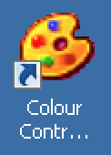

# Colour Contrast Analyser

**Having sufficient contrast between foreground and background colours is an essential part of usability in general and accessibility in particular. The Colour Contrast Analyser (CCA) is a tool that calculates the contrast between two colours and automatically evaluates the returned value against the Web Content Accessibility Guidelines.**

[[toc]]

## Installation

[Download Colour Contrast Analyser](https://www.paciellogroup.com/resources/contrastanalyser/).

As it does not have an installer, you can simply extract it to a folder of your liking.

## Usage

Simply enter a foreground and a background colour into the respective fields and the CCA returns whether or not the contrast ratio is sufficient, depending on the kind of visual content and size. The evaluation uses the recommendations from the Web Content Accessibility Guidelines for [colour contrast level AA](https://www.w3.org/TR/WCAG21/#contrast-minimum) and [colour contrast level AAA](https://www.w3.org/TR/WCAG21/#contrast-enhanced).

Note: if you choose to use the colour picker instead, be sure to avoid anti-aliased colours, as this would have an impact on the result.

For more information about colour contrast in general, there is a [dedicated chapter: Colors and contrast](/knowledge/colours-and-contrast/).
