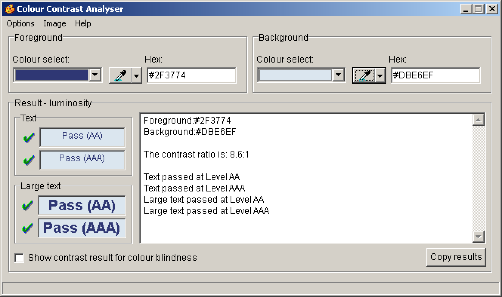

# Colour Contrast Analyser

**It is the job of frontend designers to choose contrasty foreground and background colours. To double check this while implementing the design, it is always good to have the right tool at hand. The Colour Contrast Analyser (CCA) helps to determine the legibility of text and other visual elements by ensuring high contrast with the background.**

## Installation

[Download Colour Contrast Analyser](https://www.paciellogroup.com/resources/contrastanalyser/).

As it does not have an installer, you can simply extract it to a folder of your liking.

## Usage

Enter foreground and background colours into the respective fields, then check the displayed results.

Note: if you choose to use the colour pickers instead, be sure to avoid anti-aliased colours, as this would have an impact on the result.