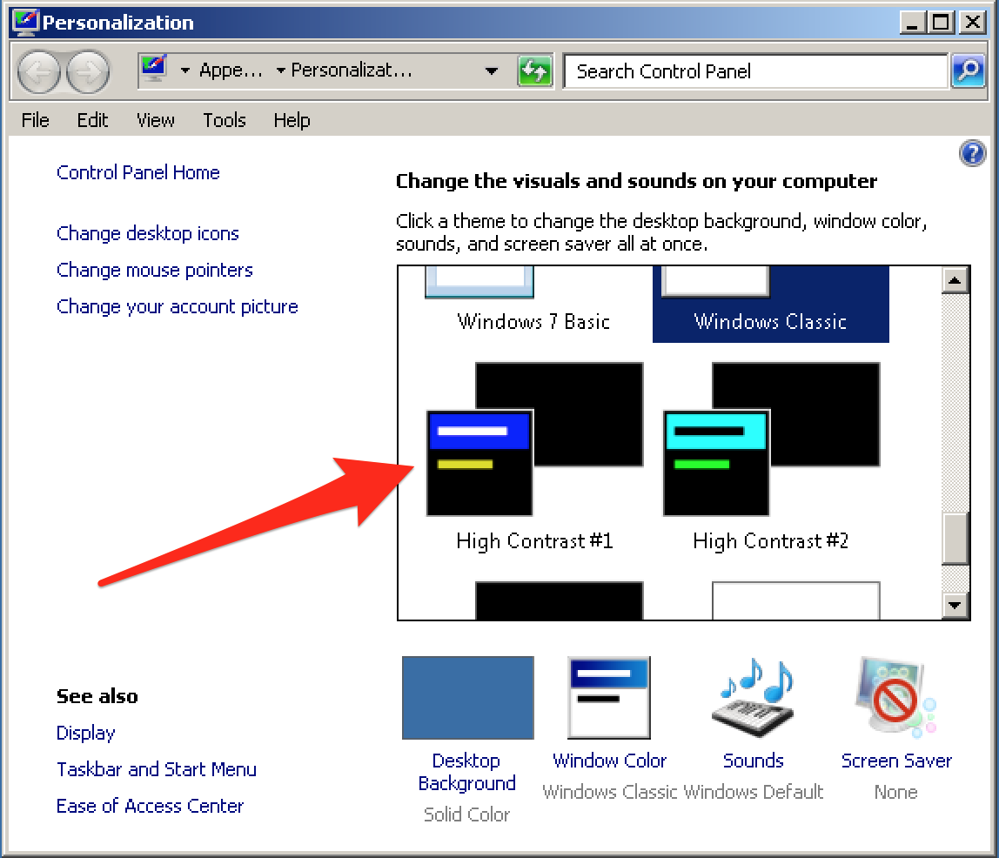
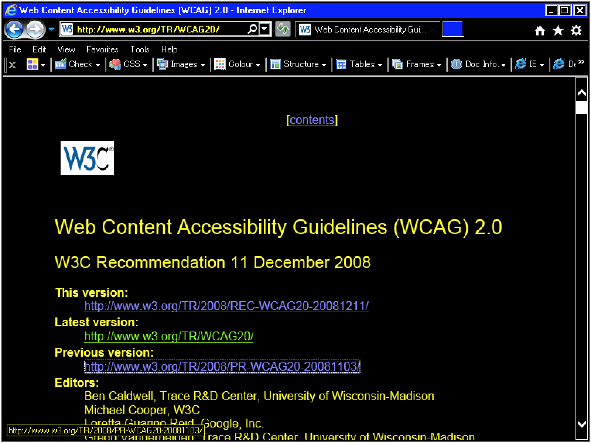

# Windows High Contrast Mode

**Windows high contrast mode (Win HCM) changes the colours on the screen to a specific high-contrast scheme. It is used by visually impaired people. It is a useful tool to ensure that visual information is not conveyed with purely decorative styles.**

[[toc]]

## Installation

HCM is a built-in feature of the Windows operating systems and does not need to be installed separately.

## Usage

You can toggle HCM using the keyboard shortcut `Alt + Shift + PrtScn`. Alternatively, you can manually go to `Control Panel` -> `Change the theme` and select one of the "High Contrast" themes.

Now take a look at your website in Edge and ensure that all visual information is still perceivable. For example, when the currently active link in a navigation is marked using a symbol, this symbol still needs to be displayed in HCM. Also, the keyboard focus always needs to be clearly perceivable. Do not use Firefox or Chrome when you are testing HCM.

