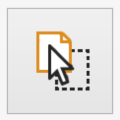
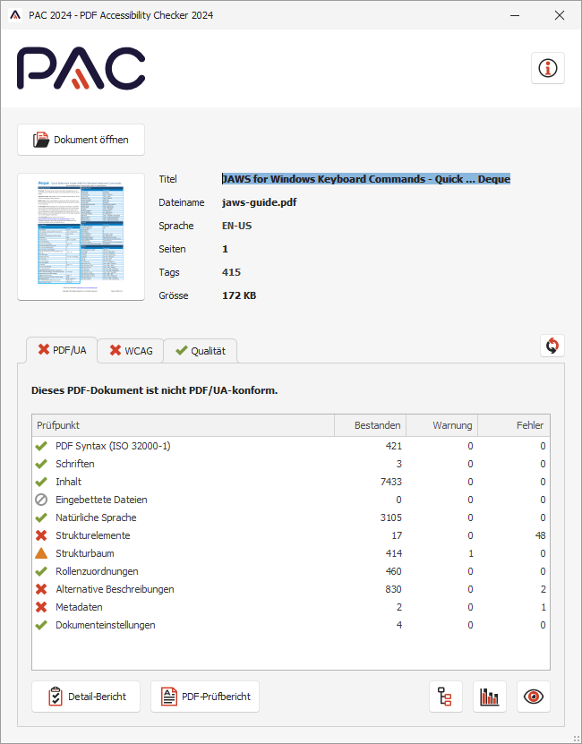
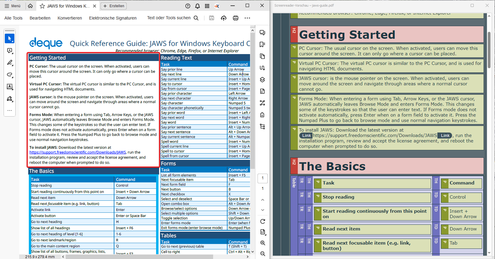

# PDF Accessibility Checker

**The PDF Accessibility Checker (PAC) provides a fast way to test the accessibility of PDF files. On one hand, it checks whether the PDF/UA standard is met. On the other hand, it offers a great preview feature that visually displays the document similar to the way a screen reader perceives it, making it easy to spot problems in both sequence and meaning of elements.**

[[_TOC_]]

{ style="max-width:350px;" }

## Installation

[Download PDF Accessibility Checker](https://pac.pdf-accessibility.org/en){ target=_blank }.

As it does not have an installer, you can simply extract it to a folder of your liking.

## Usage

Launch PAC. To examine a PDF document, click on the `Select PDF File` button.

Inspect the displayed results.

To ensure that the PDF's content is marked up correctly and the elements are ordered properly, open the `Screen Reader Preview` and compare it with the original document.

