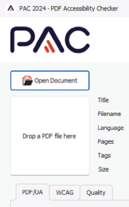

# PDF Accessibility Checker

**The PDF Accessibility Checker (PAC) provides a fast way to test the accessibility of PDF files. On one hand, it checks whether the PDF/UA standard is met. On the other hand, it offers a great preview feature that visually displays the document similar to the way a screen reader perceives it, making it easy to spot problems in both sequence and meaning of elements.**

[[_TOC_]]

{ style=max-width:350px }

## Installation

[Download PDF Accessibility Checker](https://pac.pdf-accessibility.org/en){ target=\_blank }.

As it does not have an installer, you can simply extract it to a folder of your liking.

## Usage

Launch PAC. To examine a PDF document, click the `Open Document` button or drag the file to the area labeled `Drop a PDF file here`.

{ style=max-width:218px;margin-bottom:1em }

Inspect the displayed results.

{ style=margin-bottom:1em }

To ensure that the PDF's content is marked up correctly and the elements are ordered properly, open the `Screen Reader Preview` and compare it with the original document.

{ style=margin-bottom:1em }

For recommendations how to use PAC, please see: [access-for-all.ch/en/accessibility-of-pdf-documents-and-misconceptions-about-pac](https://access-for-all.ch/en/accessibility-of-pdf-documents-and-misconceptions-about-pac/){ target=\_blank }
