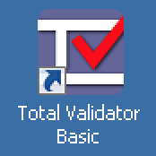
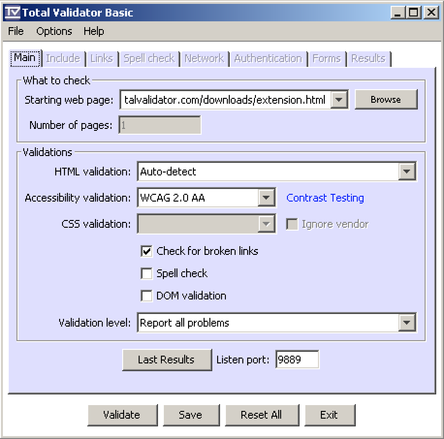
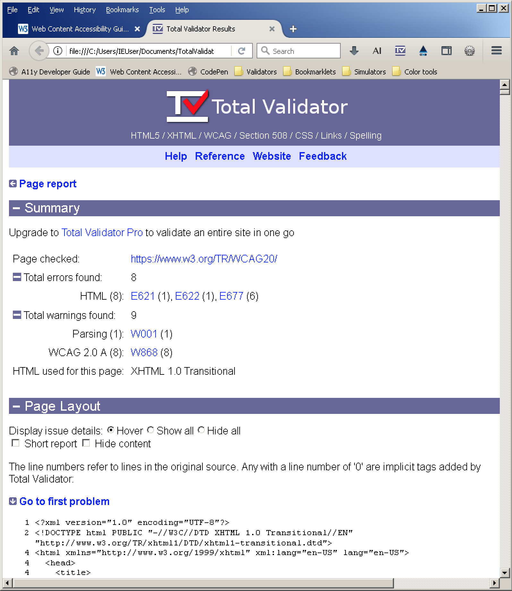
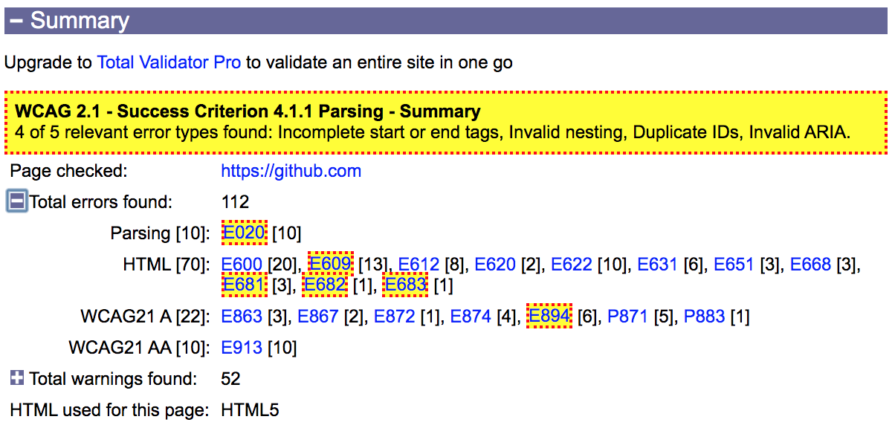

# TotalValidator

**TotalValidator checks your website regarding various web and accessibility standards by the press of a button. Building valid code is one of the highest goals developers should strive for. TotalValidator helps a lot with achieving this.**

[[toc]]

## Installation

[Download TotalValidator](https://www.totalvalidator.com/downloads/index.html) and run the installer. Then install [Chrome and Firefox extensions](https://www.totalvalidator.com/downloads/extension.html).

## Configuration

Under `Validations`, we recommend to disable `Check for broken links`, as it slows the tool down.

## Usage

After launching it, open your website in either Firefox or Chrome, and activate TotalValidator by clicking its icon in the browser toolbar.

Inspect the displayed results (which vary from parsing errors to very specific accessibility warnings).

## Which ones are relevant for accessibility?

The bookmarklet [Filter relevant TotalValidator results](https://codepen.io/jmuheim/pen/yLNqERL) is an attempt to give a pragmatic answer to this question. It scans the summary of a results page, looking out for the following 5 types of error codes, highlighting them visually:

- Incomplete start/end tags
- Invalid nesting
- Duplicate attributes
- Duplicate IDs
- Invalid ARIA

It shows a summary of its findings, as well:

Check out the bookmarklet's description text for more details.
