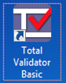
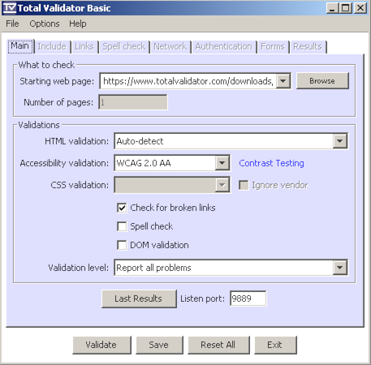

# TotalValidator

{.image}

# Installation

[Download TotalValidator](https://www.totalvalidator.com/downloads/index.html) and run the installer. Then install [Chrome and Firefox extensions](https://www.totalvalidator.com/downloads/extension.html).

# Configuration

# Usage

{.image}

After launching it, open your website in either Firefox or Chrome, and activate TotalValidator by clicking its icon in the browser toolbar: {.image}.

Inspect the displayed results.