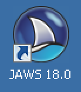
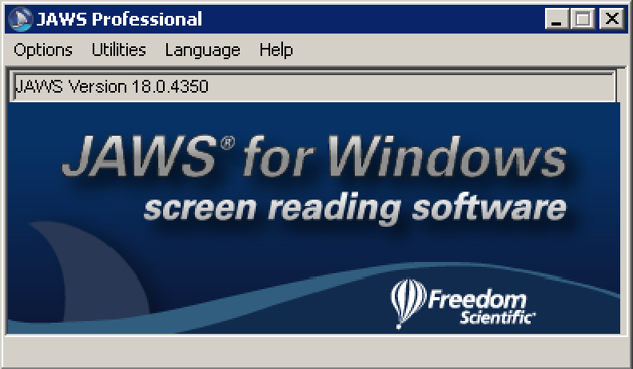
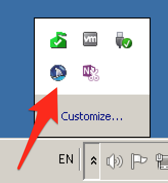
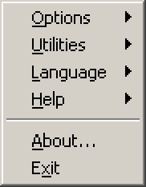
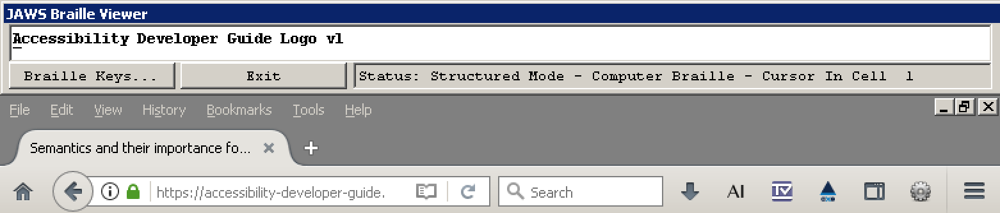
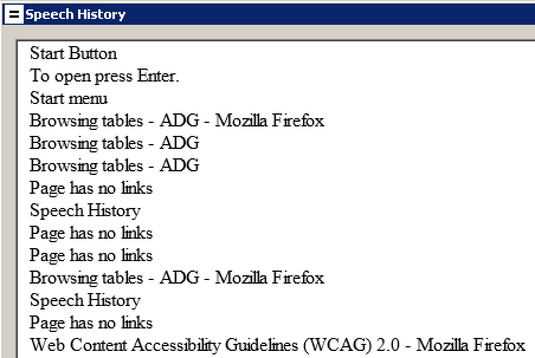

# JAWS installation and configuration

**JAWS (Job Access With Speech) is one of the most-used desktop screen readers. Therefore it's very important to ensure its compatibility with your websites. Due to its heavy weight, JAWS is a rather clumsy companion while developing, but it's absolutely crucial to fire it up every now and then for counterchecking accessibility on desktop.**

[[toc]]

## Installation

JAWS is a quite heavy piece of software that installs itself deeply into the Windows operating system. To keep your existing Windows clean, it is a good idea to install JAWS inside a virtual machine (VM), see [Windows operating system](/setup/windows).

As JAWS is commercial software with its price, it can be checked out using its free demo version, allowing you to run it for 40 minutes.

[Download JAWS](http://www.freedomscientific.com/Downloads/JAWS) and simply run the installer, or see [JAWS Quick Start (PDF, FreedomScientific.com)](http://www.freedomscientific.com/Content/Documents/Manuals/JAWS/JAWS-Quick-Start-Guide.pdf) for detailed information.

## Running JAWS

### Starting

Start JAWS using its icon on the desktop.

After it has launched, you have to restart your web browser(s) to make JAWS interact with them correctly.

### Using the menu

By default, JAWS displays its own application window while running.

To save space in the taskbar, JAWS should run in the system tray:

- In JAWS, open `Options` -> `Basics`.
- Select `Run JAWS from System Tray`.
- Confirm and restart JAWS.

From now on, you won't see much of JAWS except a small icon in the system tray.

.

By clicking on the icon, the JAWS menu is displayed.

Alternatively, you can press `JAWS + J` to display it. By default, the `JAWS` key is the `Insert` key (if you are really curious and want to learn more about this, skip ahead and read [The Insert Modifier Key](/knowledge/screen-readers/desktop/insert-modifier-key)).

The best way to use the JAWS menu is by keyboard:

- Use the arrow keys to navigate it and press `Enter` to select an item.
- For even quicker navigation, press the letter on your keyboard that is underlined in the intended menu item.
    - For example, press `X` for `Exit`.
    - In this guide, we indicate those letters by putting parentheses around them, for instance like so: `E(x)it` or `(H)elp`.
- You can close the menu items by pressing `Esc`.

### Silencing JAWS on demand

While JAWS is running, it's announcing whatever your screen is currently showing.

- To make JAWS abort the current stream of words, press the `Ctrl` key.
- To make JAWS shut up completely, you can toggle speech mode by pressing `JAWS + Space`, then `S`.
    - Be aware though that JAWS is still running in the background, so your computer may behave differently in some situations!

### Braille viewer

JAWS does not offer a `Speech Viewer` like NVDA (see [NVDA installation and configuration](/setup/screen-readers/nvda)), but at least its `Braille Viewer` gives some basic information about where the JAWS focus currently is.

The braille viewer sits on top of the screen. Its output often contains cryptic elements like `vl` (for being on a visited link) or `r2c3` (for being in row 2 and column 3 within a table).

### Speech history

Sometimes it's interesting to see what JAWS announced in the past (or to copy&paste some output).

To open the output history:

- Press `JAWS + Space` (a *beep* will be played), then `H`.
- The history shows that last 20 announcements.
- Sadly, the history does not refresh automatically.

## Configuration

Screen readers in general offer tons of configuration options which can drastically influence their behaviour. We advise to stick to the defaults. The following configuration suggestions are known to be useful and safe though.

### Disable auto forms mode (optional)

JAWS by default switches automatically between interaction modes (if you are really curious about this, skip forward and read [Screen readers' browse and focus modes](/knowledge/screen-readers/desktop/browse-focus-modes)). While programming and testing (especially complex JavaScript widgets), this behaviour can be a bit nasty.

This mode can be disabled, so it is similar to NVDA. **But we urge you to only do this if you really know what you are doing.**

- Open Firefox.
- Press `JAWS + V` (this opens the QuickSettings of the currently open application).
- Enter "form" into the search field.
- In `Virtual Cursor Options` look out for `Form Options`, then `Auto Forms Mode`.
- Choose `SemiAuto` and confirm.

Do the same in Internet Explorer.
