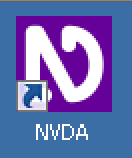
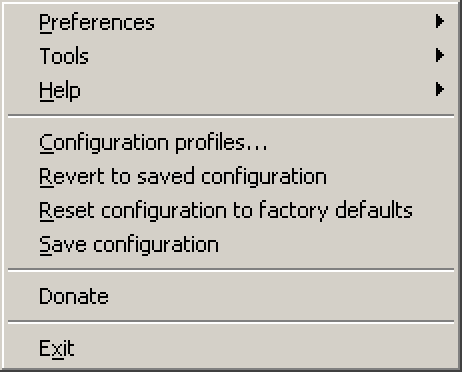

# NVDA installation and configuration

**NVDA (Non Visual Desktop Access) is a lightweight and reliable open source desktop screen reader. Because of its firm compliance to standards, it is the desktop screen reader of choice when developing accessible websites. After using it for a while, you will respect it as a firm but fair teacher.**

[[toc]]

## Installation

[Download NVDA](http://www.nvaccess.org/download/).

### Normal installation

Normal installation offers automatic startup on boot (optional), a keyboard shortcut to start/restart it, association with proprietary files, etc.

We recommend the normal over portable installation (see below).

Simply run the installer, or see [Installing NVDA (NVAccess.org)](http://www.nvaccess.org/files/nvda/documentation/userGuide.html?#toc11) for detailed information.

### Portable installation

NVDA offers the option to be run as a portable app, so no installation is required (and thus no admin rights). While for our purposes it works fine, it has some restrictions, see [Portable and Temporary Copy Restrictions (NVAccess.org)](http://www.nvaccess.org/files/nvda/documentation/userGuide.html?#toc10).

For detailed information, see [Creating a Portable Copy (NVAccess.org)](http://www.nvaccess.org/files/nvda/documentation/userGuide.html?#toc15) (be sure to manually create a new folder as installation location, for example `NVDA` on your Desktop).

## Running NVDA

### Starting

If you chose normal installation, you can start (and restart) NVDA any time by pressing the `Ctrl + Alt + N`, or using its icon on the desktop.

If you chose portable installation, simply start NVDA using the `NVDA.exe` in its installation folder.

### Using the menu

After starting NVDA and clicking away its start screen, you won't see much of it except a small icon in the system tray.

.

By clicking on the icon, the NVDA menu is displayed.

Alternatively, you can press `NVDA + N` to display it. By default, the `NVDA` key is the `Insert` key (if you are really curious and want to learn more about this, skip ahead and read [The Insert Modifier Key](/knowledge/screen-readers/desktop/insert-modifier-key).

The best way to use the NVDA menu is by keyboard:

- Use the arrow keys to navigate it and press `Enter` to select an item.
- For even quicker navigation, press the letter on you keyboard that is underlined in the intended menu item.
    - For example, press `E` for `Exit`.
    - In this guide, we indicate those letters by putting parentheses around them, for instance like so: `(E)xit` or `(H)elp`.
- You can close the menu items by pressing `Esc`.

### Silencing NVDA on demand

While NVDA is running, it's announcing whatever your screen is currently showing.

- To make NVDA abort the current output, press `Ctrl` (or `Shift` to skip the current line).
- To make NVDA shut up completely, you can toggle speech mode by pressing `NVDA + S`.
    - Be aware though that NVDA is still running in the background, so your computer may behave differently in some situations!

### Speech viewer

The speech viewer displays NVDA's audio output in text form, which is an invaluable help for sighted users.

The speech viewer can be opened through the NVDA menu by choosing `(T)ools` → `(S)peech viewer`.

There are some useful options:

- You can make the speech viewer open automatically on startup.
    - Do so by activating the `(S)how Speech Viewer on Startup` checkbox, located at the speech viewer's bottom left.
- You can zoom the font size using `Ctrl` + mouse wheel.
    - At the time being, font size is always set back to default on quit.

We highly recommend to have the speech viewer always open while using NVDA. Place it on the top right of your screen and resize your browser window accordingly so they do not overlap each other. To allow system tray popups some headroom, do not give the speech viewer full height.

## Configuration

Screen readers in general offer tons of configuration options which can drastically influence their behaviour. We advise to stick to the defaults. The following configuration suggestions are known to be useful and safe though.

### Disabling mouse focus

By default, when moving the mouse cursor, NVDA announces the objects below it. This is useful for blind users who are scanning the screen by luck, looking out for something. But for visually non-impaired developers, this can be really annoying.

We can disable mouse focus as follows:

- In the NVDA menu, choose `(P)references` -> `(M)ouse settings`.
- Disable `Enable mouse tracking` and confirm.

### Disabling "Say All" on page load

By default, after loading a website, NVDA automatically starts reading aloud all content. This is not what developers usually want, so we disable that:

- In the NVDA menu, choose `(P)references` → `(B)rowse mode`.
- Disable `Automatic say all on page load` and confirm.

Now NVDA stops after reading the current element, waiting for the user to proceed manually to the next element.

### A bearable voice synthesizer (optional)

The standard NVDA voice synthesizer is a bit robotic. While it is a fast and very accurate one, it may sound odd to some. So let's install a nicer, more natural one.

- [Download Svox Pico add-on](http://files.nvaccess.org/nvda-addons/svox-pico-2.0.nvda-addon) and install it.
- In the NVDA menu, choose `(P)references` → `(S)ynthesizer`.
- As synthesizer, choose `Svox pico synthesizer`, and confirm.
- In the NVDA menu, choose `(P)references` → `(V)oice settings`, choose your desired voice, and confirm.

### GUI language (optional)

You can choose the language of NVDA itself (the GUI, not the voice):

- In the NVDA menu, choose `(P)references` → `(G)eneral settings`.
- Choose your desired language and confirm.
    - We suggest you are using `English, en` to be able to easily follow this guide.

### Keyboard layout (optional)

NVDA offers a `Desktop` and a `Laptop` keyboard layout. For this guide, `Laptop` is used:

- In the NVDA menu, choose `(P)references` → `(K)eyboard settings`.
- Choose `laptop` as keyboard layout and confirm.

### Disabling exit confirmation (optional)

By default, NVDA displays a confirmation window on exit.

You can disable that:

- In the NVDA menu, choose `(P)references` → `(G)eneral settings`.
- Disable `Sho(w) exit options when exiting NVDA` and confirm.

## Add-ons

There are lots of add-ons for NVDA in the [NVDA Community Add-ons website (NVDA-Project.org)](https://addons.nvda-project.org/index.en.html).

### FocusHighlight

This add-on visually indicates where NVDA's internal cursor currently is on the screen — an invaluable help for sighted users.

There are several indications:

- A green border is painted around the element where the browse cursor currently is.
- A red border is painted around the element where the focus cursor currently is.
    - The red border turns into blue when the element is being interacted with.

If you are really curious and want to learn more about these different cursor types, skip ahead and read [Screen readers' browse and focus modes](/knowledge/screen-readers/desktop/browse-focus-modes).

[Download FocusHighlight add-on](http://addons.nvda-project.org/addons/focusHighlight.en.html) (stable version) and install it!

### Optional add-ons

Here are some more of our personal favourites:

- [Tip of the day](http://addons.nvda-project.org/addons/tipOfTheDay.en.html) shows usage tips on startup.
- [No beeps speech mode](http://addons.nvda-project.org/addons/noBeepsSpeechMode.en.html) excludes "Beeps" in speech mode when toggling speech modes (`NVDA + S`).
- [Control usage assistant](http://addons.nvda-project.org/addons/controlUsageAssistant.en.html) offers help for the currently focused item when pressing `NVDA + H`.
