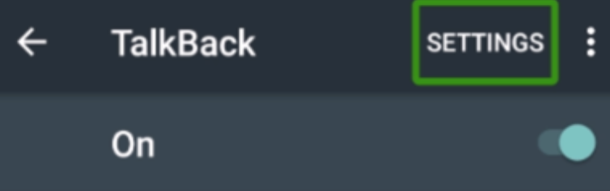
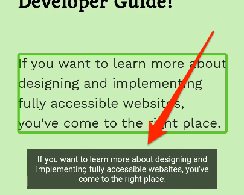

# TalkBack configuration

**TalkBack is the mobile screen reader of Android. It is pre-installed on Android devices, easy to understand, and the most used mobile screen reader in non-Western countries. Because of its rather unreliable activation shortcut, TalkBack is a bit less convenient than VoiceOver/iOS, but still needs to be used for frequent counterchecking accessibility on mobile platforms.**

[[toc]]

On some older Android versions, the TalkBack service is not enabled by default. In this case, just install or update the [Android Accessibility Suite](https://play.google.com/store/apps/details?id=com.google.android.marvin.talkback&hl=en_US) from the Google Play Store.

Android comes equipped with a number of accessibility features which can usually be configured under `Settings` -> `Accessibility`.

We find the default settings to be sensible and a good starting point. But if you want to explore further, extensive information about the TalkBack setup options can be found at the [official TalkBack setup page](https://support.google.com/accessibility/android/answer/6283655).

## Running TalkBack

### A little warning first

When TalkBack is running, interaction with the touch screen of your device is very different to default behaviour. If you do not know how to handle it, you may have a hard time using your phone - in the worst case you may not know how to stop TalkBack anymore and be left with a "weird" and seemingly uncontrollable device!

To be safe, please make sure you have configured the start/stop shortcut (see below) before playing around with TalkBack.

### Shortcut

This setting allows the user to quickly activate the Android accessibility features, including TalkBack.

- On newer Android versions, the shortcut is operated by pressing both volume keys for 3 seconds.
- On older Android versions this was a 2-step procedure, requiring you to first press the power button and then press both volume keys for 5 seconds.

We've found that, in practice, no matter the Android version, the shortcut may or may not work, depending on the device brand and further user interface customisations done by the vendor.

### Manual start/stop

You can also start and stop TalkBack manually. Go to `Settings` -> `Accessibility`, then toggle `TalkBack`.

### Display Speech Output

This setting displays the current announcement as visual text on screen.

