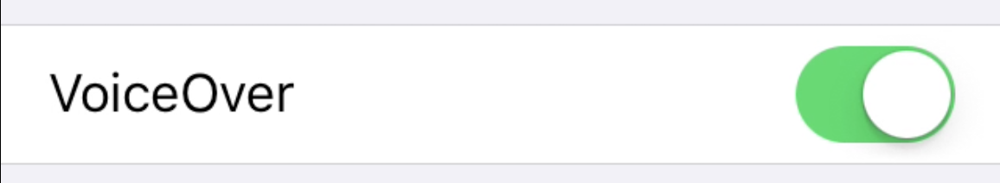

# VoiceOver/iOS configuration

**VoiceOver/iOS is the most advanced mobile screen reader. It is pre-installed on iOS devices (and as such is free), easy to use, and the most used mobile screen reader in Western countries.**

By the way: to avoid confusion between VoiceOver on iOS and macOS, we always add the operating system to its name: VoiceOver/iOS and VoiceOver/macOS.

## Running VoiceOver/iOS

### A little warning first

When VoiceOver/iOS is running, interaction with the touch screen of your device is very different to default behaviour. If you do not know how to handle it, you may have a hard time using your phone - in the worst case you may not know how to stop VoiceOver/iOS anymore and be left with a "weird" and seemingly uncontrollable device!

Please take a look at "General usage" below to get acquainted with the most basic usage patterns.

### Shortcut

The best way to toggle VoiceOver/iOS is to assign it to the accessibility shortcut. Go to `Settings` -> `General` -> `Accessibility` -> `Shortcut` and select `VoiceOver`.

Now simply triple tap (press three times in rapid succession) the Home button to turn VoiceOver on or off. VoiceOver says "VoiceOver on" or "VoiceOver off" according to its status.

### Manual start/stop

You can also start and stop VoiceOver/iOS manually. Go to `Settings` -> `General` -> `Accessibility`, then toggle `VoiceOver`.
