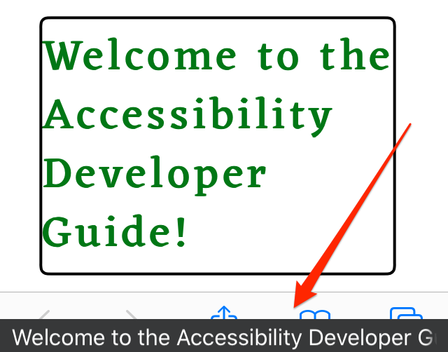

# VoiceOver/iOS configuration

**VoiceOver/iOS is the most advanced mobile screen reader. It is pre-installed on iOS devices, easy to understand, and the most used mobile screen reader in Western countries. Because of its reliable and easy activation shortcut, it is the mobile screen reader of choice when developing accessible websites.**

[[toc]]

## iOS vs. macOS

By the way: VoiceOver is available for both mobile (iOS) and desktop (macOS) platforms. To avoid confusion, we always add the operating system to its name: VoiceOver/iOS and VoiceOver/macOS.

By the way: although VoiceOver/macOS is one of the most advanced and user friendly screen readers today, it is not part of our guide. This is due to the fact that it is not as widespread as Windows screen readers (if you are really curious and want to learn more about this, skip ahead and read [Relevant combinations of screen readers and browsers](/knowledge/screen-readers/relevant-combinations/)).

## Running VoiceOver/iOS

### A little warning first

When VoiceOver/iOS is running, interaction with the touch screen of your device is very different to default behaviour. If you do not know how to handle it, you may have a hard time using your phone - in the worst case you may not know how to stop VoiceOver/iOS anymore and be left with a "weird" and seemingly uncontrollable device!

To be safe, please make sure you have configured the start/stop shortcut (see below) before playing around with VoiceOver/iOS.

### Shortcut

The best way to toggle VoiceOver/iOS is to assign it to the accessibility shortcut. Go to `Settings` -> `General` -> `Accessibility` -> `Shortcut` and select `VoiceOver`.

Now simply triple tap (press three times in rapid succession) the Home button to turn VoiceOver on or off. VoiceOver says "VoiceOver on" or "VoiceOver off" according to its status.

### Manual start/stop

You can also start and stop VoiceOver/iOS manually. Go to `Settings` -> `General` -> `Accessibility`, then toggle `VoiceOver`.

### Display Caption Panel

This setting displays the current announcement as visual text on screen.

