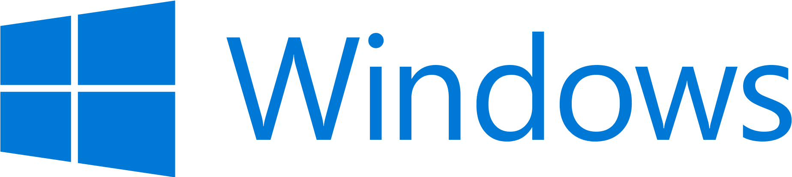

# Windows operating system

**To ensure the accessibility of websites, the most important software is native Windows software, such as desktop screen readers. In this chapter, you will learn how to prepare everything for the upcoming installation tasks. And if you want to keep your own Windows working environment clean (or if you aren't using Windows anyway), we suggest you set up a dedicated Windows installation within a virtual machine.**

{.no-border}
