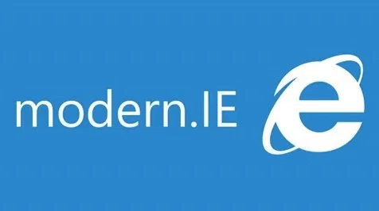

# Getting a free Windows virtual machine from Modern.IE

**Microsoft's service Modern.IE offers to download pre-configured virtual machines running Windows. While their licenses expire after 90 days of use, by creating a snapshot before activation, they can easily be reset again. This is the easiest way to get your needed Windows environment up and running quickly.**

## What is Modern.IE?

[Modern.IE](http://modern.ie) is a service provided by Microsoft. It is used by web developers in need of testing different versions of Internet Explorer:

- All virtual machines (VM) from Modern.IE can be downloaded freely, but their licenses will expire after 90 days.
    - However, if you are creating a snapshot of your VM's state before activating Windows online, you'll be able to reset the expiration as often as needed. The latter is recommended in the [official release notes (Modern.IE)](https://az792536.vo.msecnd.net/vms/release_notes_license_terms_8_1_15.pdf).
- The VMs are meant to be used for testing purposes only.

We suggest you download the VM `IE11 on Win7`, but any modern Windows version should do.

## Default user and password

VMs from Modern.IE have the following login credentials:

- User: `IEUser`
- Password: `Passw0rd!`

Note: VMs from Modern.IE are set up with US-English keyboard layout. Therefore, the exclamation mark is triggered using `Shift + 1`.

If you want to change the password, see [Change your Windows password (Windows Support)](https://support.microsoft.com/en-us/help/14087/windows-7-change-your-windows-password).

Be sure to change the VM's keyboard layout to your preferred one as described here: [How to change your keyboard layout (Windows Support)](https://support.microsoft.com/en-us/help/258824/how-to-change-your-keyboard-layout).