# Configuring VMware Fusion on macOS

**On macOS, running Windows as a virtual machine needs some special configuration, especially to integrate it seamlessly into the daily workflow. Once properly set up, accessibility testing on macOS will be as comfortable as it gets.**

[[_TOC_]]

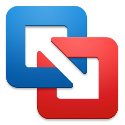

## Installing VMware Fusion

You need to create a free account on [Broadcom](https://www.broadcom.com/) to download VMware Fusion. 
After logging in, go to the `Sidebar` -> `Click "Free Software Downloads available HERE"` -> `Search for VMware Fusion` -> `Choose version` -> `Accept license agreement` -> `Download`

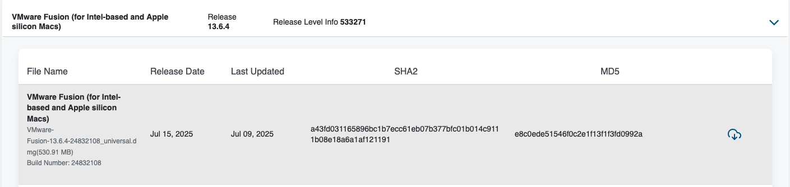

After installing and launching you have the option to choose a previously downloaded Windows ISO image or you may also let VMware Fusion download a Windows for you. We recommend the second option because it is the most straightforward one.

- Choose `Get Windows from Microsoft`. Then `Windows Home`. This will download a Windows version for you.
- If for any reason the second option does not work for you, you can download the Windows ISO from the following URL:
  [Windows ISO download](https://www.microsoft.com/en-us/software-download/windows11arm64).

For both cases go through the default installation process. 

## Booting up the VM for the first time

You need to have a Microsoft account. For Windows Home, you can just create an outlook address and log into Windows with that one.
You might be prompted to allow internet. For internet access you need to install VMware Tools. 
- Go to `Virtual Machine` -> `Install VMware Tools` in the menu bar of VMware Fusion.

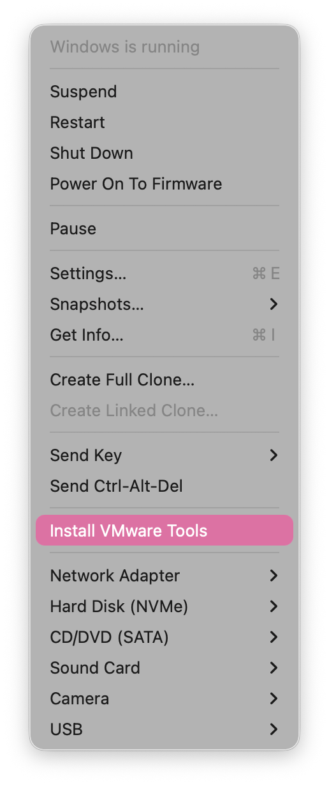

- Click on `Install driver` in the Windows installation process window.

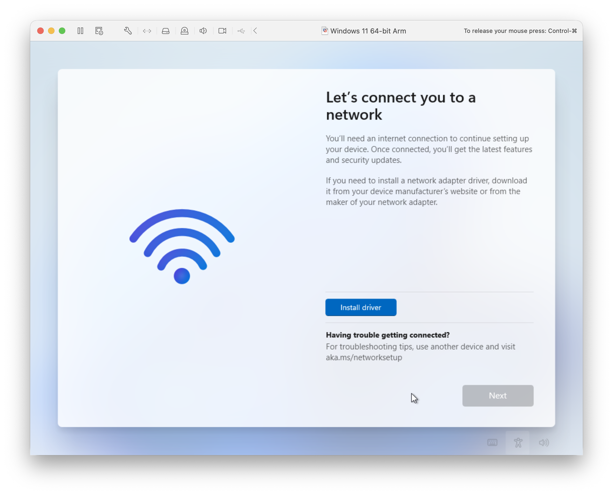

- Browse the newly installed VMware Tools.

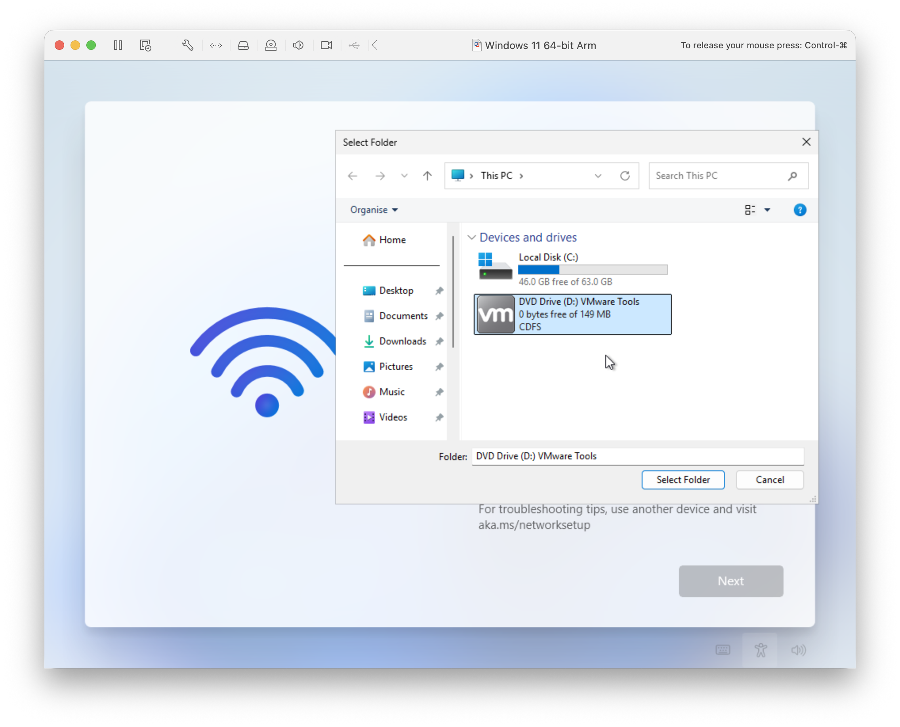

## Improving seamless integration

To make you feel as comfortable as possible when working with it, we suggest the following additional configuration steps.

### Disabling left Windows key

In VMware Fusion, the left `Command` key by default is assigned to the left `Windows` key. Pressing `Command + Tab` therefore often interferes with the left `Windows` key, opening and closing the "Start" menu of the VM seemingly randomly.

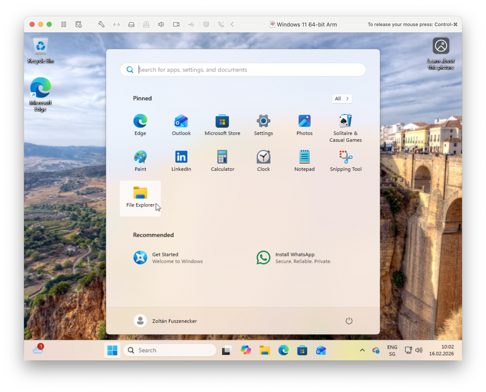

If you want to prevent this:
- `VMware Fusion` -> `Preferences` -> `Keyboard & Mouse` -> `Edit Profile`-> `Mac Host Shortcuts`.
- There is an option called `Enable Mac OS Host Keyboard Shortcuts`
  
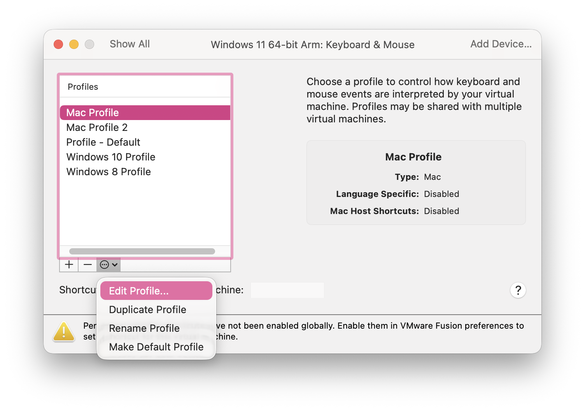
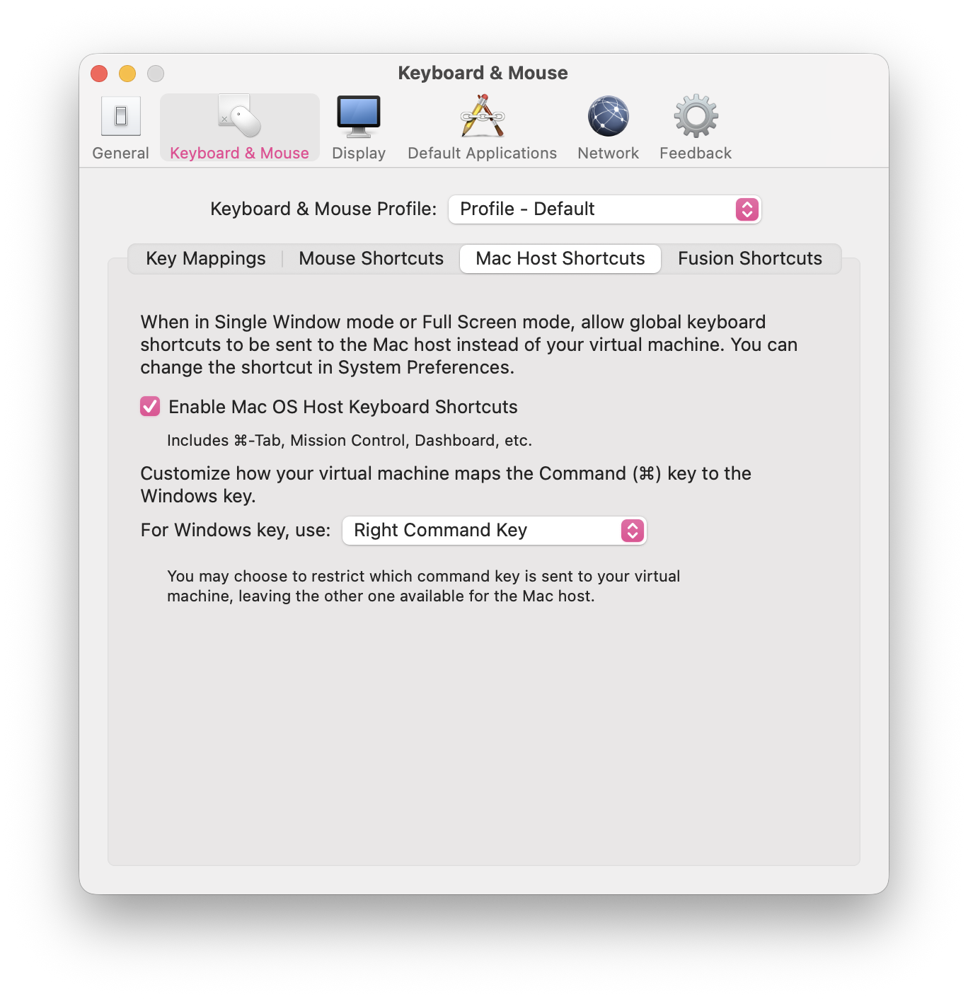

This option has two consequences:
1. `Command` + `Tab` will work to switch between Mac apps, but not to switch between Windows apps and it won't open 
the Start menu in Windows either.
2. Windows' Narrator app for accessibility has a default key combination 
`Control` + `right/left arrow` which lets the user tab through each word. This will not work, since macOS will handle
this key combination. The default mac behaviour for this key combination is switching between desktops.

You can try to deselect the `Mac Host Shortcuts` checkbox and use following setting for using `Command` + `Tab` in 
the Macbook. However it is not working always.
- `For Windows key, use` select `Right Command key`.

If this setting is working correctly you can use the right `Command` key to open and close the "Start" menu, 
while leaving the left `Command` key for switching between Mac apps.

### Changing behaviour of function keys

Windows desktop screen readers make use of the function keys (`F1` to `F12`) a lot.

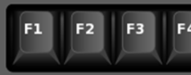

By default, in macOS, you have to press the `Fn` key in addition to the specific function key to trigger it.

Keyboard shortcuts of desktop screen readers are quite tricky (if you are really curious and want to learn more about this, skip ahead and read [The Insert Modifier Key](/knowledge/screen-readers/desktop/insert-modifier-key) and also [Screen Reader Shortcuts](/knowledge/screen-readers/desktop/screenreader-shortcuts)). As the function keys are often part of them, we suggest that you [change the behaviour of function keys (Apple Support)](https://support.apple.com/en-us/HT204436) so you do not have to use the `Fn` key for them, too.

### Emulating the Insert key

Windows desktop screen readers rely heavily on the `Insert` key.

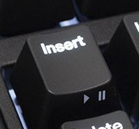

- `VMware Fusion` -> `Preferences` -> `Keyboard & Mouse` -> `Edit Profile`-> `Key Mappings`. Here, click the plus and add your mapping.

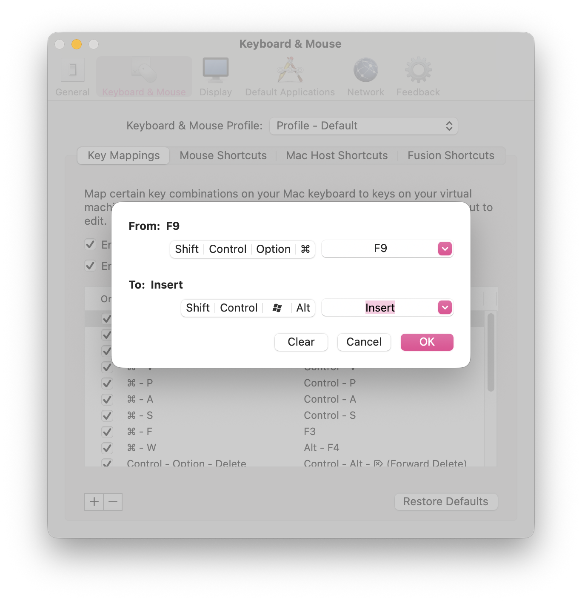

This key is not available on Macs (in earlier days of macOS, it was the "Help" key), so you will have to emulate it. The most robust way to do this is using the free software Karabiner-Elements which translates any given key to any other in macOS.

- Download [Karabiner-Elements](https://pqrs.org/osx/karabiner/) and install it.
    - Be sure to allow its execution in the `System Preferences`' `Security & Privacy` section.
- After launching it, add a `Simple Modification`:
    - From `right_option` to `insert`.
    - Instead of `right_option`, you can choose any key you like. Make sure it is one you do not really need in your daily workflow.

Alternatively, you can attach a physical [USB num lock keyboard](https://lmgtfy.com/?q=USB+num+lock+keyboard) (or any other keyboard offering an `Insert` key) to your Mac.

## Working seamlessly with the VM

We think it's easiest to have VMware running in `Single Window` mode (default):

- Use `Command + Tab` to switch between Mac apps.
- Use `Option + Tab` to switch between Windows apps (when VMware is active).

If you want all Windows apps to be accessible from the Dock (and thus also in the application switcher when pressing `Command + Tab`), the "Unity" mode is pretty cool, too. Even the Windows' task bar icons will appear in the Mac's menu bar.
