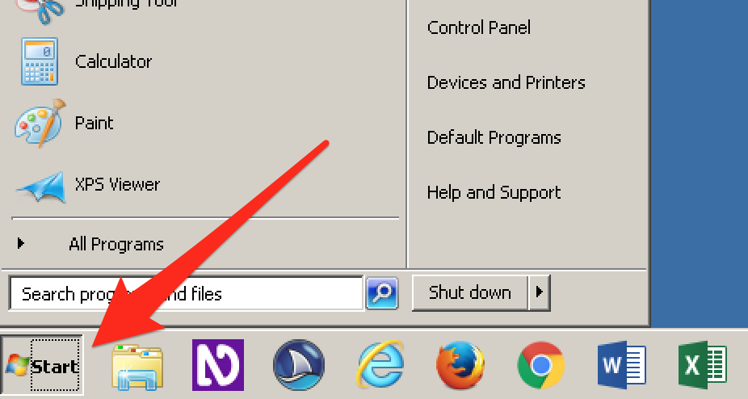
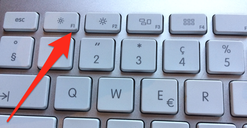

# Configuring VMware Fusion on macOS

**On macOS, running Windows as a virtual machine needs some special configuration, especially to integrate it seamlessly into the daily workflow. Once properly set up, accessibility testing on macOS will be as comfortable as it gets.**

[[toc]]

## Preparing the virtual machine

Before you proceed, be sure you have downloaded a pre-configured virtual machine (VM) as described here: [Getting a free Windows virtual machine from Microsoft](/setup/windows/virtual-machines).

Then extract the VM (using [The Unarchiver](http://wakaba.c3.cx/s/apps/unarchiver.html), as the built-in unzip version is not capable of zip64 files) to a proper location, for example `~/Virtual Machines`.

## Installing VMware Fusion

After downloading [VMware Fusion](http://www.vmware.com/ch/products/fusion), installing and launching it:

- Choose `File` -> `Import`, select the `*.ovf` file in the extracted folder and confirm.
- Take a snapshot (`Command + Shift + S`).
    - This allows to easily go back to that state later, meaning you can re-activate the VM's Windows 90-day license again and again.
    - For more info, see [Understanding snapshots (VMware)](https://kb.vmware.com/s/article/1014509).
- Under `Virtual Machine` -> `Settings`:
    - If you have a retina display, go to `Display` and deselect `Use full resolution for Retina display` (otherwise your eyes will begin to hurt).
    - Go to `Processors & Memory`, then select at least 2000MB of memory.
    - To be able to connect to the internet, click `Add Device...` and choose `Network Adapter`.
        - Use option `Share with my Mac`.

## Booting up the VM for the first time

Start the VM. User and password can be found here: [Getting a free Windows virtual machine from Microsoft](/setup/windows/virtual-machines).

## Improving seamless integration

Simply having a Windows machine run on your beloved Mac may already feel creepy. To make you feel as comfortable as possible when working with it, we suggest the following additional configuration steps.

### Disabling left Windows key

In VMware Fusion, the left `Command` key by default is assigned to the left `Windows` key. Pressing `Command + Tab` therefore often interferes with the left `Windows` key, opening and closing the "Start" menu of the VM seemingly randomly.

If you want to prevent this:

- `VMware Fusion` -> `Preferences` -> `Keyboard & Mouse` -> `Mac Host Shortcuts`.
- Then under `For Windows key, use` select `Right Command key`.

Remember that you can still use the right `Command` key to open and close the "Start" menu.

### Changing behaviour of function keys

Windows desktop screen readers make use of the function keys (`F1` to `F12`) a lot.

By default, in macOS, you have to press the `Fn` key in addition to the specific function key to trigger it.

Keyboard shortcuts of desktop screen readers are quite tricky (if you are really curious and want to learn more about this, skip ahead and read [The Insert Modifier Key](/knowledge/screen-readers/desktop/insert-modifier-key) and also [Screen Reader Shortcuts](/knowledge/screen-readers/desktop/screenreader-shortcuts)). As the function keys are often part of them, we suggest that you [change the behaviour of function keys (Apple Support)](https://support.apple.com/en-us/HT204436) so you do not have to use the `Fn` key for them, too.

### Emulating the Insert key

Windows desktop screen readers rely heavily on the `Insert` key.

This key is not available on Macs (in earlier days of macOS, it was the "Help" key), so you will have to emulate it. The most robust way to do this is using the free software Karabiner-Elements which translates any given key to any other in macOS.

- Download [Karabiner-Elements](https://pqrs.org/osx/karabiner/) and install it.
    - Be sure to allow its execution in the `System Preferences`' `Security & Privacy` section.
- After launching it, add a `Simple Modification`:
    - From `right_option` to `insert`.
    - Instead of `right_option`, you can choose any key you like. Make sure it is one you do not really need in your daily workflow.

Alternatively, you can attach a physical [USB num lock keyboard](http://lmgtfy.com/?q=USB+num+lock+keyboard) (or any other keyboard offering an `Insert` key) to your Mac.

## Working seamlessly with the VM

We think it's easiest to have VMware running in `Single Window` mode (default):

- Use `Command + Tab` to switch between Mac apps.
- Use `Option + Tab` to switch between Windows apps (when VMware is active).

If you want all Windows apps to be accessible from the Dock (and thus also in the application switcher when pressing `Command + Tab`), the "Unity" mode is pretty cool, too. Even the Windows' task bar icons will appear in the Mac's menu bar.
