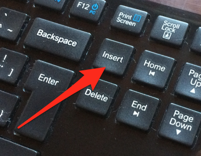

# Configuring VMware Workstation Pro on Windows (and Linux)

**Even if you are already running Windows as your operating system, it is highly recommended making the initial effort needed to set up another Windows within a virtual machine, configured specifically for accessibility testing. This keeps your own system clean and makes accessibility testing much more comfortable.**

[[toc]]

## Windows vs. Linux

While the following instructions are written specifically for the Windows version of VMware Workstation Pro, they should be applicable in a similar way to the Linux version.

## Preparing the virtual machine

Before you proceed, be sure you have downloaded a pre-configured VM as described here: [Getting a free Windows virtual machine from Microsoft](/setup/windows/virtual-machines).

Extract the VM to a proper location, for example `C:\Virtual Machines\Accessibility Testing`.

## Installing VMware Workstation Pro

Notice: we recommend using [VMware Workstation Pro](https://www.vmware.com/products/workstation-pro.html) in our guide. But there is also [VMware Workstation Player](https://www.vmware.com/products/workstation-player.html): it is cheaper, but has limited functionality, for example it's missing the snapshots feature (see below).

After downloading VMware Workstation Pro, installing and launching it:

- Click `Open a virtual machine`, select the `*.ovf` file in the extracted folder, and confirm.
- Take a snapshot (`Ctrl + Shift + S`).
    - This allows to easily go back to that state later, meaning you can re-activate the VM's Windows 90-day license again and again.
    - For more info, see [Understanding snapshots (VMware)](https://www.vmware.com/support/ws5/doc/ws_preserve_sshot_understanding.html).
- Click `Edit virtual machine settings`.
    - Go to `Processors & Memory`, then select at least 2000MB of memory.
    - To be able to connect to the internet, at the bottom of the `Hardware` tab, click `Add`.
        - From the `Hardware types` list, choose `Network Adapter`, then click `Next`.
        - Select `NAT: Used to share the host's IP address`, click `Finish`, then `OK`.

## Booting up the VM for the first time

Start the VM. User and password can be found here: [Getting a free Windows virtual machine from Microsoft](/setup/windows/virtual-machines).

## Improving seamless integration

### Emulating the Insert key

Windows desktop screen readers rely heavily on the `Insert` key.

This key is not easily available on some keyboards, so you may have to emulate it. The easiest way to do this is using the SharpKeys software.

- SharpKeys translates any given key to any other (in the VM itself).
- In the VM, download [SharpKeys](http://sharpkeys.codeplex.com/), install and launch it.
- Click `Add`, then map any key you like (for example the right `Alt` key `E0_38`) to `Insert` key `E0_52`.
- Click `OK` and `Write to Registry`.
- Restart the VM.

## Working seamlessly with the VM

We recommend you play around with "Single Window" and "Unity" modes to find out what fits you best.
